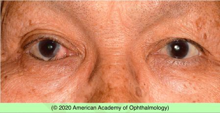
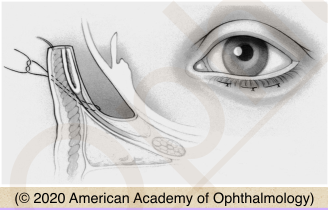

# Entropion

## Images

## Hierarchy

- Case Description
  - elderly woman complains of foreign-body sensation and tearing of her right eye
  - Image Description
    - inversion of the right lower eyelid margin
- Data acquisition
  - History
    - onset & course
      - symptoms
        - FB sensation/irritation
        - tearing
        - redness
    - medications
      - miotics
    - surgery/trauma/chemical burn
    - infection
    - autoimmune/autoreactive/ allergic
    - other skin lesions
      - SJS, MMP
  - Physical Exam
    - facial/lid spasms
    - epiphora
    - conjunctival injection
    - cornea
      - SPK/abrasion
      - ulcer
    - involutional entropion
      - horizontal lid laxity
        - snapback and distraction testing
      - deeper-than-normal inferior fornix
      - herniated orbital fat
      - white subconjunctival line several millimeters below the inferior tarsal border
      - reverse ptosis of the lower eyelid
        - little or no inferior movement of the lower eyelid on downgaze
          - caused by the leading edge of the detached retractors
            - lower eyelid margin sits higher than normal
          - detected by observation of the preseptal orbicularis as the patient squeezes his or her eyes closed
      - decreased lower eyelid excursion
      - orbicularis override
      - digital eversion test
    - cicatricial entropion
      - inspection of the posterior lamella reveals scarring
        - distinguishes cicatricial entropion from involutional entropion
- Assessment
  - entropion, involutional
- Differential Diagnosis
  - congenital
  - involutional entropion
  - cicatricial entropion
    - mucous membrane pemphigoid
    - Steven-Johnson syndrome
    - trauma/surgery
    - chemical injury
    - radiation
    - infection
      - adenoviral conjunctivitis
        - EKC
      - beta-hemolytic streptococcal conjunctivitis
      - trachoma
      - herpes simplex
      - varicella zoster
    - autoimmune/autoreactive/allergic
      - atopic keratoconjunctivitis
      - rosacea/blepharitis
      - sarcoidosis
      - scleroderma
      - graft-vs-host disease
    - toxic blepharoconjunctivitis
      - pilocarpine
      - echothiophate iodide
        - acetylcholinesterase inhibitor
      - demecarium bromide
      - epinephrine
      - timolol
      - idoxuridine
    - linear IgA deficiency
      - can result in an ocular syndrome that is clinically identical to MMP
  - spastic entropion
    - essential blepharospasm
    - ocular irritation
    - surgical trauma
- Treatment
  - Medical
    - aggressive lubrication
    - antibiotic ointment
      - bacitracin
      - erythromycin
        - for SPK
    - adhesive tape
      - temporizing
    - bandage contact lens
      - for corneal involvement
  - Surgical
    - involutional
      - horizontal lid tightening
      - lid retractor repair
    - cicatricial
      - excision of scar tissue + skin/ tarsal/conj grafts
    - spastic
      - suture techniques (Quickert sutures)
        - recurrence is anticipated
      - Botox injection
- Patient Education
  - General
    - discuss treatment options
      - discuss possible recurrence
  - Prognosis & Complications
    - corneal complications
  - Follow-up
    - depends on severity of corneal involvement
