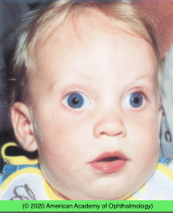

# Exotropia

## Images

## Hierarchy

- Case Description
  - 10-month-old boy is brought because his mother has noticed intermittent outward drifting of his eyes
  - Image Description
    - external photograph shows large angle exotropia
- Additional Testing
  - MRI brain & orbits if ...
    - orbital signs
    - neurologic signs
    - convergence paralysis
      - dorsal midbrain syndrome
    - internuclear ophthalmoplegia
  - wu for MG if suspected
- Assessment
  - XT intermittent, alternating
- Differential Diagnosis
  - intermittent XT
    - most common
    - amblyopia rare
    - onset <5 years
    - increases over time
    - exposure to bright light often causes reflex closure of 1 eye
      - "squint"
  - Infantile XT
    - onset <6 months
    - associated with craniofacial or CNS disorders
    - large angle
  - sensory XT
    - any condition that severely reduces vision or the visual field in 1 eye
  - consecutive XT
    - develops after previous surgery for esotropia (postsurgical exotropia)
  - Duane retraction syndrome type 2
    - XT
    - limited adduction
      - globe retraction and narrowing of palpebral fissue on attempted adduction
    - head turn away from the affected side
  - isolated convergence insufficiency
    - older children or adults
    - blurred vision, asthenopia, diplopia when reading
    - exodeviation is greater at near fixation than at distance fixation
  - convergence paralysis
    - XT at near
      - normal adduction and accommodation
    - acute onset
    - intracranial lesion
      - most commonly associated with dorsal midbrain syndrome
  - other forms of XT
    - CN 3 palsy
    - MG
    - CPEO
    - INO
      - WEBINO
    - orbital disease
      - proptosis
      - limitation of EOM
  - pseudo-XT
    - 1. wide interpupillary distance
    - 2. temporal macular dragging
    - 3. large positive angle kappa
- Treatment
  - Medical
    - correct significant refractive errors
      - myopia
      - hyperopia >+4.00 D
    - overminused spectacles to stimulate accommodative convergence
      - 2-4 D
    - base-out prisms to improve fusional convergence
    - correct amblyopia if present
    - alternating XT, no amblyopia
      - alternate patching 2 hr/day
        - decreases fusional vergence
    - base-in prisms
      - not for long-term management
  - Surgical
    - infantile XT
      - surgical correction early in life
    - intermittent XT
      - surgery not necessary unless ...
        - frequently manifest
          - .>50% of the time
        - poorly controlled
        - worsening (especially at near)
        - symptomatic
        - poor self-image
        - decreased distance stereoacuity
    - muscle surgery
      - bilateral LR recession
      - unilateral recess-resect procedure
      - large (>50Δ) deviations may require surgery on 3 or 4 muscles
  - convergence paralysis
    - base-in prism at near
- Patient Education/ Counselling
  - Course
    - intermittent XT can be progressive
  - Prognosis
    - typically do not develop amblyopia
    - often develop good stereopsis
      - if no amblyopia
  - Follow-up
    - every 4-6 months
      - sooner if XT ...
        - XT increases
        - XT becomes more frequent or stays out longer
          - .>50% of the time
        - patient closes one eye
- Data acquisition
  - History
    - ask about symptoms
      - not seeing well/ clumsiness/ frequent blinking/eye rubbing
      - diplopia
    - age of onset
      - review old photos
        - deviation
        - fixation preference
    - intermittent vs. constant
    - one eye or both eyes (alternating)
    - prematurity
    - family hx of strabismus
      - ROP can cause macular dragging --> + angle kappa
  - Physical Exam
    - VA
      - preferential looking tests
        - Teller cards
    - pupil examination
      - CN 3 palsy
      - RAPD
    - stereopsis
      - titmus stereoacuity card
    - extraocular motility
      - limitation of adduction
      - globe retraction on adduction
        - DRS type 2
      - A-pattern or V-pattern
      - DVD
    - measure deviation
      - at near & distance
      - comitant vs incomitant
      - cover tests
        - cover-uncover test
          - differentiates tropia from phoria
        - alternate cover test
          - prism alternate cover test
            - plastic prisms should be held parallel to frontal plane
            - do not stack prisms
            - prisms can be divided between the 2 eyes
      - for measurement of deviation
      - light reflex tests
        - Hirschberg
          - 22Δ/ mm
          - 30Δ at pupil margin
          - 60Δ at mid-iris
          - 90Δ at limbus
        - Krimsky
          - uses prisms to center light reflex
    - anterior segment exam
      - media opacities
    - posterior segment exam with dilation
      - retinal pathology
        - sensory XT
      - optic nerve pathology
    - (cycloplegic or manifest) refraction
      - intermittent XT can be associated with myopia
- cannot differentiate tropia from phoria
