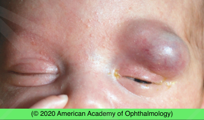

# Eyelid Hemangioma

## Images

## Hierarchy

- Case Description
  - 2-month-old infant has been brought for evaluation of an enlarging reddish lump on her left upper lid
  - Image Description
- Assessment
  - eyelid hemangioma
- Differential Diagnosis
  - eyelid hemangioma
    - risk factors
      - female
        - external photograph shows reddish-blue mass of left upper lid
      - low birth weight
      - prematurity
      - maternal chorionic villus sampling
    - natural course
      - present at birth or in the first few weeks of life
      - enlarge dramatically over 6–12 months
      - involute after the first year of life
        - 75% resolve during the first 3–7 years
    - ± hemangiomas of other parts of the body
      - lesions involving neck can compromise airway
      - multiple large visceral lesions can produce thrombocytopenia
        - Kasabach-Merritt syndrome
  - lymphangioma
  - preseptal cellulitis
  - port-wine stain
- Treatment
  - indications for treatment
    - occlusion of the visual axis (severe ptosis)
    - anisometropia
      - cause amblyopia
    - strabismus
    - significant disfigurement
  - methods of treatment
    - observation
      - refractive correction
        - defer treatment until it is clear that the natural course will not lead to the desired result
      - amblyopia therapy
    - beta-blockers
      - first line of treatment
      - topical timolol gel
        - for superficial tumors
      - oral propranolol
        - for larger and deeper lesions
        - fewer adverse effects than systemic steroids
          - bradycardia
          - hypoglycemia
    - steroids
      - for lesions unresponsive to β-blockers
      - systemic steroid
        - growth retardation
      - intralesional steroid
        - skin necrosis
        - subcutaneous fat atrophy
        - growth retardation
        - CRAO
    - excision
      - for nodular lesions that are smaller, subcutaneous, or refractory to medical treatment
    - radiation therapy
      - complications
        - cataract formation
        - bony hypoplasia
        - future malignancy
    - pulsed-dye laser therapy
      - superficial components of the hemangioma
    - sclerosing solutions
      - severe scarring
        - not recommended !
- Data acquisition
  - History
    - onset & course
      - see old photos
    - change in lesion size/ appearance with crying
  - Physical Exam
    - VA
    - APD
    - lid position
      - blocking visual axis
    - head position
      - chin-up
    - proptosis
    - extraocular motility/alignment
    - dilated fundus exam
    - cycloplegic refraction
      - astigmatism
    - warmth/tenderness
      - preseptal cellulitis
    - fever
    - hemangiomas elsewhere in the body
- Patient Education/ Counselling
  - Disease course
    - enlargement during the first year
    - spontaneous resolution after a few years (4 years)
  - Prognosis
    - good if amblyopia prevented/treated
  - Complications
    - amblyopia
      - ptosis
      - astigmatism
      - strabismus
- Additional Testing
  - orbital imaging
    - indications
      - proptosis
      - limitation of extraocular motility/strabismus
      - optic neuropathy
