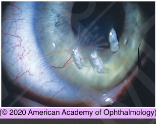

# Filamentary Keratopathy

## Images

## Hierarchy

- Case Description
  - 70-year-old woman complains of burning, light sensitivity, and dry sensation of both eyes
- Image Description
  - of filamentary keratopathy
- Additional Testing
  - stare test
    - after a few blinks, patient is asked to look at a visual acuity chart
      - normally the time until the image blurs should be > 8 seconds
  - tear break-up time
    - appearance of dry spots in <10 seconds is considered abnormal
  - basal tear secretion
    - topical anesthetic
    - inferior cul-de-sac is dried
    - strip is left in place for 5 minutes
      - Schirmer strip is bent at the notch and placed with the short end resting on the conjunctiva and the fold crease on the eyelid margin
        - at the lateral one-third of the lower eyelid
    - normal
      - ≈10–15 mm
  - Schirmer I and Schirmer II tests
    - Schirmer I test
      - to evaluate both basic and reflex tearing
    - Schirmer II test
      - no anesthetic
      - tear strip in place
        - cotton-tipped applicator is placed in the nostril and moved back and forth for 2 minutes
      - to distinguish between fatigue block (when reflex secretion is suppressed because of chronic irritation) and a lack of function of the reflex secretors
- Differential Diagnosis
  - dry eye syndrome (DES)
    - most common cause
      - corneal filaments and corneal vascularization
  - prolonged patching
  - topical drug toxicity
  - SLK
    - superior cornea
      - pannus
      - punctuate epithelial erosions
      - filaments
  - recurrent corneal erosion
  - exposure keratopathy
  - neurotrophic keratopathy
  - irregular corneal surface
    - surgical wound
- like basal tear secretion test, but no topical anesthetic is used
- Assessment
  - filamentary keratitis secondary to dry eye
- Treatment
  - Medical
    - artificial tear drops
      - preservative-free
      - 6-8x/day
    - artificial tear ointment
      - qhs
    - punctal plug
    - restasis
    - autologous serum
    - oral fish oil
    - moisture chamber goggles
    - therapeutic contact lens
      - monitor closely
        - not for patients with severe dry eye
      - +- topical antibiotic
    - topical mucomyst (acetylcysteine ) 10%
      - qid
  - Surgical
    - mechanical removal of filaments
      - jeweler forceps
      - cotton-tipped applicator
    - tarsorrhaphy
- Data acquistion
  - History
    - medical history
      - autoimmune disorders
        - DES
      - diabetes
      - cigarette smoking
    - consider neurotrophic keratopathy, if asymptotic
    - ocular history
      - symptoms
        - onset & course of symptoms
          - worse toward the end of the day
            - worse with prolonged use of the eyes
        - FB sensation
        - pain
        - red eye
        - tearing
        - photophobia
        - eye pain/FB sensation upon waking
          - recurrent corneal erosion
      - dry eye
        - treatment for dry eye
      - dry mouth
      - eye patching
      - topical medication
  - Physical Exam
    - blepharitis
    - lagophthalmos
    - conjunctival papillary (or follicular) hypertrophy
    - tear film height
      - <0.3 mm is abnormal
    - location of corneal filaments
      - superior
        - SLK
      - inferior
        - exposure keratopathy
    - fluorescein staining
      - look for punctate/gross epithelial erosions
        - neurotrophic keratopathy
    - corneal sensation
- Patient Education
  - Prognosis
    - good
  - Course
    - chronic disease
      - may need treatment for life
  - Complications
    - corneal infection
