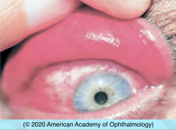
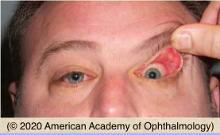

# Floppy Eyelid Syndrome

## Images

## Hierarchy

- Case Description
  - 60-year-old obese man presents with bilateral eye redness, foreign-body sensation, and mild mucous discharge, worse upon awakening
  - Image Description
- Data acquisition
  - History
    - medical history
      - weight gain/obesity
      - diabetes
      - hypertension
      - obstructive sleep apnea
        - daytime fatigue
        - heavy snoring
        - hypertension
          - vernal/atopic
      - seasonal allergies, asthma, eczema
      - thyroid disease
        - SLK
    - ocular history
      - onset & course of symptoms
      - contact lens wear
      - ocular trauma/surgery
        - exposed suture
        - foreign body
      - current topical medication
  - Physical Exam
    - apply upward pressure on eyelids
      - laxity
      - spontaneous eversion
    - slit lamp exam
      - conjunctival papillary rxn
        - upper tarsal
      - fluorescein staining of cornea
      - corneal pannus, filaments, scarring
      - signs of atopic/vernal keratoconjunctivitis
      - signs of infectious keratoconjunctivitis
      - keratoconus
- Additional Testing
  - check blood glucose
- Differential Diagnosis
  - floppy eyelid syndrome
    - clinical presentation
      - obese male
      - bilateral
        - external photograph of the left eye shows lax, everted upper eyelid with diffuse papillary hypertrophy of the upper tarsal conjunctiva
      - superior tarsal plate is soft, rubbery, flaccid, and easily everted when pulled up toward the forehead
      - ocular irritation
        - worse on awakening
      - mild mucus discharge
      - ptosis
      - superior tarsal chronic papillary conjunctivitis
      - SPK
      - associations
        - obesity
        - hyperglycemia
        - sleep apnea
        - keratoconus
        - eyelid rubbing
  - vernal conjunctivitis
    - seasonal
    - itching
    - giant papillary rxn
  - atopic keratoconjunctivitis
  - giant papillary conjunctivitis
    - contact lens wear
    - exposed suture/foreign body
  - superior limbic keratoconjunctivitis
    - hyperemia/thickening of superior bulbar conjunctiva
  - toxic keratoconjunctivitis
    - eyedrops
      - long-term use of certain topical ophthalmic medications
        - demecarium bromide
    - inferior tarsal>superior tarsal
- Assessment
  - floppy eyelid syndrome
- Treatment
  - Medical
    - bedtime
      - artificial tears/ointment
      - taping
      - patching
      - wearing shield
      - moisture chamber goggles
    - antibiotic ointment
      - if corneal abrasion or severe corneal erosion
  - Surgical
    - horizonal lid tightening
  - Referrals
    - refer for obstructive sleep apnea
- Patient Education
  - General
    - do not sleep face down
    - explain relationship between FES and obstructive sleep apnea
      - hypertension
        - cardiac disease
- timolol
  - pilocarpine
    - echothiophate iodide
      - acetylcholinesterase inhibitor
  - epinephrine
  - idoxuridine
