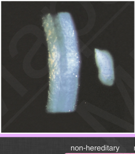

# Fuchs Endothelial Dystrophy

## Images

## Hierarchy

- Case Description
  - 70-year-old woman with bilateral blurred vision that is worse upon awakening in the morning
  - Image Description
    - “beaten metal” appearance of the corneal endothelium with mild stromal edema
- Additional Testing
  - pachymetry (corneal thickness)
  - specular microscopy
    - normal endothelial cell count
      - After birth=4000
      - Young adult= 3000
      - 60 years=2500
- Assessment
  - Fuchs ED
- Differential Diagnosis
  - Fuchs ED
    - non-hereditary
      - most common
    - AD
    - predictors of corneal decompensation following intraocular surgery
      - • Hexagonality <50%
        - • coefficient of variation >0.4
          - • Endothelial cell density <1000
      - • CCT >640
      - morning increase in corneal thickness
      - presence of epithelial edema
  - ICE syndrome
    - unilateral
    - beaten-metal appearance
    - iris thinning
    - corectopia
    - polycoria
    - high IOP
  - pseudophakic bullous keratopathy
  - PPMD
    - AD
    - grouped vesicles, broad bands
    - corectopia
    - iridocorneal adhesions
    - high IOP
  - pigment dispersion syndrome
    - pigment mimics guttae
  - CHED
    - bilateral corneal edema at birth
- Treatment
  - Medical
    - warm air from a hair dryer at arm’s length every morning
    - sodium-chloride 5%
    - glaucoma drops
      - if high IOP
        - 100-200 micron thickness
  - Surgical
    - endothelial transplant
      - DSAEK
        - Descemet Membrane Endothelial Keratoplasty (DMEK) is very similar to DSAEK, except that the donor tissue implanted does not include any stromal tissue
          - 10-15 micron thickness
      - DMEK
    - descemetorhexis
      - removal of a relatively small area of abnormal Descemet
      - results in mitosis of normal endothelial cells from the periphery causing resolution of corneal edema
      - ± topical and/or intracameral Rho kinase (ROCK) inhibitor
    - PK
      - if anterior corneal scarring
    - evaluate corneal health before cataract surgery
      - if stromal edema
        - triple procedure
          - high pachymetry readings or low endothelial cell count are not indications for triple procedure
      - worsening corneal edema after cataract surgery
- Patient Education
  - General
    - AD inheritance in some cases
  - Course
    - slowly progressive
  - Complications
    - corneal edema
  - Follow-up
    - every 3-12 months
- Data acquistion
  - History
    - onset & course of symptoms
      - decreased vision
        - variation during the day
          - worse in the morning
      - pain
        - bullous keratopathy
    - previous cataract surgery
    - family history of similar condition or corneal graft
  - Physical Exam
    - BCVA
    - IOP
    - microcystic epithelial edema
    - stromal corneal edema
    - endothelial changes
      - corneal guttae
        - best seen with retroillumination
      - grouped vesicles, broad bands on retroillumination
        - PPMD
    - fluroescein staining
      - intact/ruptured bullae
    - Krukenberg spindle
      - pigment dispersion syndrome
    - examine other eye
      - unilateral vs bilateral
