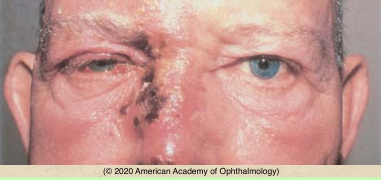
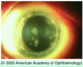
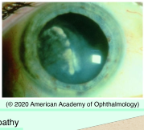

# Herpes Zoster Ophthalmicus (HZO)

## Images

## Hierarchy

- Case Description
  - 70-year-old man with history of pain, redness, and increased sensation around his right eye
  - Image Description
    - in immunosuppressed patients, zoster may involve more than 1 branch of the trigeminal nerve at the same time and may be chronic with multiple recurrences
- Additional Testing
  - diagnosis is clinical and cultures not routinely necessary
  - scrapings from the base of a vesicle
    - cytology
    - PCR
    - viral culture
    - VZV antige
- Assessment
  - HZO
- aging
  - majority are otherwise healthy
    - periocular redness, vesicular rash, and crusting around the right eye in the distribution of ophthalmic division of trigeminal nerve
- HIV infection
  - trauma/surgery
  - debilitating disease
  - systemic malignancy
    - immunosuppressive therapy
- Differential Diagnosis
  - herpes zoster ophthalmicus
    - reactivation of latent virus due to a waning level of immunity
      - radiation therapy
    - 6th-9th decade of life
    - unilateral
    - pain
    - paresthesia
    - skin rash
      - vesicular
      - dermatomal
        - trigeminal nerve
          - 1st division more often afffected
            - Hutchinson sign
              - spares the lower lid
      - can leave significant scarring
      - postherpetic neuralgia can continue for months to years
    - conjunctivitis
    - corneal involvement
      - punctate & dendritic keratitis
        - branching or “medusa-like”
        - stain minimally with fluorescein and rose bengal
        - blunt rather than bulbous ends
      - stromal keratitis
        - nummular corneal infiltrates
        - interstitial keratitis/disciform keratitis in HZO are clinically indistinguishable from HSV infection
        - complications
          - corneal opacity
          - corneal vascularization
          - lipid keratopathy
          - neurotrophic keratopathy
    - uveitis
    - elevated IOP
    - sectoral iris atrophy
    - retinitis
  - herpes simplex (HSV)
    - younger
    - not dermatomal (incomplete)
    - less pain
    - does not cause skin scarring
    - no postherpetic neuralgia
- Treatment
  - Medical
    - oral antiviral
      - decreases
        - viral shedding from vesicular skin lesions
        - chance of systemic dissemination
        - incidence and severity of the most common ocular complications
        - may reduce the duration and severity if not the incidence of postherpetic neuralgia
          - if begun within 72 hours of the onset of symptoms
      - drugs
        - oral acyclovir
          - 800 mg 5x/day
        - famciclovir
        - valacyclovir
        - x 7-10 days
        - best if started within 72 hours of the onset of skin lesions
    - intravenous antiviral
      - in patients at risk for disseminated zoster due to immunosuppression
    - topical antiviral medications
      - not effective
        - except
          - corneal epithelial mucoid plaques
          - more chronic epithelial disease
    - zoster vaccine
      - live, attenuated zoster vaccine
      - recombinant zoster vaccine
        - preferred vaccine for immunocompetent adults ≥50 years
        - decreases the risk of VZV by >90%
      - vaccination in patients with previous HZO
        - potential to reactivate or exacerbate HZO-related inflammation
        - should be administered during an extensive quiet period
    - dermatitis
      - moist warm compresses and
      - topical antibiotic ointment
    - conjunctivitis
      - cool compress
      - ophthalmic antibiotic ointment
    - conjunctival/corneal dendrites/pseudodendrites
      - preservative-free artificial tears
      - ophthalmic antibiotic ointment
      - topical antivirals
        - ganciclovir gel
    - immune stromal (disciform) keratitis with no epithelial defect
      - topical steroid
    - uveitis
      - oral antiviral
        - often beneficial in intraocular inflammation associated with HSV or VZV uveitis
      - topical steroid
      - topical cycloplegic
        - initiation of oral antiviral therapy at the onset of VZV uveitis is recommended
    - retinitis
      - intravenous antivirals
      - intravitreal antivirals
      - oral steroid
      - retinal photocoagulation
    - pain/neuralgia
      - cold compress
      - oral analgesics
      - capsaicin cream
        - amitriptyline, desipramine, clomipramine, or carbamazepine
      - topical lidocaine patch 5%
      - EMLA cream
      - gabapentin
      - referral to a pain management specialist
    - neurotrophic keratopathy
      - artificial tears, gels, or ointments
      - punctal occlusion
      - tarsorrhaphy
  - Referrals
    - medical evaluation if immunodeficiency suspected
      - .>60 years old
        - especially if systemic steroid treatment is to be initiated
      - other organ systems/non- ophthalmic sites involved
- difficult to treat
- Data acquisition
  - History
    - onset & course
    - immune status
    - previous episodes
  - Physical Exam
    - lid vesicles
    - rash/vesicles elsewhere
    - IOP
    - conjunctival follicles
    - dendritic/disciform keratitis
      - fluorescein/rose bengal staining
        - patchy with herpes simplex
    - KP
    - AC rxn
    - iris atrophy/transillumination defect
      - sectoral with varicella-zoster
    - dilated fundus exam
      - retinitis
        - ARN in immunocompetent
        - PORN in immunocompromised
      - optic neuritis
    - cranial nerve examination
- Patient Education
  - Don’ts
    - avoid contact with varicella- naive pregnant women
  - Course
    - relapses may occur
  - Prognosis
    - good prognosis with treatment
      - resolves in 14 days
    - poor prognosis for retinal necrosis
  - Complications
    - postherpetic neuralgia
      - less risk if HZO treated within 72 hours with oral antiviral
  - Follow-up
    - q 1-7 days
      - then q 3-6 months
