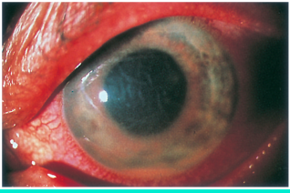

# HLA-B27 Anterior Uveitis

## Images

## Hierarchy

- Case Description
  - 27-year-old man with history of back pain complains of eye pain, eye redness, and light sensitivity
  - Image Description
- Differential Diagnosis
  - autoimmune/ inflammatory
    - HLA-B27-associated anterior uveitis
      - without systemic disease
        - hypopyon, stromal corneal edema, and conjunctival injection
      - ankylosing spondylitis
      - IBD
      - reactive arthritis (Reiter syndrome)
      - psoriatic arthritis
    - other systemic inflammatory conditions
      - Behcet's disease
      - sarcoidosis
    - ocular inflammatory conditions
      - lens-induced uveitis
      - Fuch’s heterochromic iridocyclitis
      - glaucomatocyclitic crisis
  - infectious
    - herpetic anterior uveitis
    - syphilis
    - tuberculosis
    - lyme disease
    - toxoplasmosis
    - corneal ulcer
    - endophthalmitis
  - surgical/traumatic
    - toxic anterior segment syndrome
    - UGH syndrome
    - retained IOFB
    - lens-induced uveitis
  - medications
    - rifabutin
      - antibiotic used in the prevention/ treatment of Mycobacterium avium- intracellulare infection
      - anterior & posterior uveitis
        - +- hypopyon
        - reversible
      - stellate, refractile endothelial deposits
        - initially in the periphery; may extend to the central cornea
  - masquerade syndrome
    - retinoblastoma
    - metastasis
    - lymphoma
- Additional Testing
  - first episode of a unilateral non-granulomatous anterior uveitis does not require work- up
  - uveitis work-up
    - CBC, diff
    - ESR/CRP
    - RPR/VDRL
    - ACE, lysozyme, chest CT
    - PPD, CXR
    - HLA-B27, sacroiliac x-ray
    - lyme titer
      - in endemic areas
    - conjunctival & urethral swabs for Chlamydia
- Assessment
  - anterior uveitis secondary to ankylosing spondylitis
- Treatment
  - Medical
    - topical steroid
      - q1-2 hr
    - cycloplegia
    - rheumatology consult
      - systemic NSAID
        - r/o TB, syphilis
      - oral steroid
      - immunomodulatory therapy
    - Ozurdex
      - FDA-approved for posterior uveitis
- Patient Education
  - Course
    - recurrent
  - Complications
    - glaucoma
    - cataract
    - macular edema
  - Follow-up
    - acute uveitis
      - q 1-3 days
    - no uveitis
      - routine
        - return for exam sooner if
          - eye redness
          - eye pain
          - blurriness
          - light sensitivity
- Data acquistion
  - History
    - medical history
      - back pain
        - worse upon awakening
      - joint pain
      - skin lesions
        - psoriasis
          - ulcerative colitis
            - Reiter's syndrome
      - GI complaints
      - pain on urination
      - oral ulcers
      - genital ulcers
        - Behcet disease
      - ethnic background
        - along silk road
      - medication use
      - foreign travel
      - sexually transmitted diseases
    - ocular history
      - onset & course
      - previous episodes
      - recent eye surgery/trauma
      - herpetic eye disease
  - Physical Exam
    - eyelid
      - herpetic lesions
    - conjunctiva
      - sarcoidosis granulomas
    - cornea
      - corneal ulcer, scar, ghost dendrites
      - KPs
        - stellate
          - Fuch's heterochromic iridocyclitis
        - mutton fat
          - tuberculosis
          - sarcoidosis
          - syphylis
          - JIA-associated
          - sympathetic ophthalmia
          - VKH
    - iris
      - nodules
      - PS
      - tumor
        - phacolytic/phacoanaphylactic/ lens particle
    - lens
    - gonioscopy
      - PAS
    - funduscopy
      - vitritis
      - retinitis
        - Behcet's, toxoplasmosis
