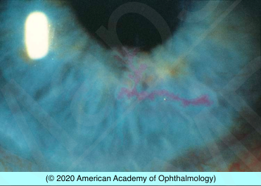

# HSV Keratitis

## Images

## Hierarchy

- Case Description
  - young woman with unilateral eye redness and foreign-body sensation and no history of eye trauma
  - Image Description
    - rose bengal staining of arborizing dendritic epithelial ulcer with terminal bulbs
- Additional Testing
  - if diagnosis in doubt
    - corneal scraping
      - Giemsa stain
        - multinucleated giant cells
        - intranuclear inclusion bodies
      - viral culture
      - PCR
- Assessment
  - HSV keratitis
- Differential Diagnosis
  - HSV
  - VZV
  - acanthamoeba keratitis pseudodendrites
    - CL wear
    - severe pain
  - healing corneal epithelial defect/ recurrent corneal erosion
  - tyrosinemia type II
    - AR
    - tyrosine aminotransferase deficiency
      - increased serum tyrosine levels
    - skin lesions on palms and soles
    - intellectual disability
    - avoid phenylalanine and tyrosine
- Treatment
  - Medical
    - topical antivirals
      - trifluridine eyedrop 1%
        - X 7-14 days
      - ganciclovir gel 0.15%
    - noncompliant patients/ children
      - oral acyclovir
        - 400 mg, 5x/day
          - effective altervative to topical treatment
    - cycloplegia
      - for photophobia
    - skin lesions
      - antibiotic ointment
      - acyclovir ointment
      - cool compress
    - if multiple recurrences of epithelial disease or stromal disease
      - prophylactic therapy with antivirals
        - oral acyclovir (famciclovir, valacyclovir)
          - 400 mg, 2x/day
        - trifluridine eyedrop 1%
          - 3-4x/day
        - ganciclovir gel 0.15%
          - 3-5x/day
    - taper topical steroids rapidly
    - stromal keratitis
      - topical steroid + oral antiviral
  - Surgical
    - debridement of infected corneal epithelium
  - Consultation/Referrals
    - internist if immunodeficiency suspected
- Patient Education
  - Prognosis & Complications
    - good prognosis
      - most cases of HSV epithelial keratitis resolve spontaneously
  - course
    - recurrences are common
  - Follow-up
    - reexamine in 2-7 days
    - if no improvement in 2 weeks, consider
      - non-compliance
      - topical drug toxicity
      - acanthamoeba
        - culture
          - non-nutrient agar with E-coli overlay
        - calcofluor white stain
- Data acquistion
  - History
    - medical history
      - precipitating factors
        - fever, stress, sunlight exposure, trauma/surgery
      - immune deficiency
        - recent systemic steroid
      - recent sexual contacts
    - ocular history
      - onset & course of symptoms
        - pain
        - redness
        - photophobia
        - tearing
        - FB sensation
        - FB sensation upon awakening
      - previous episodes
      - periocular vesicles
      - CL wear
      - recent eye trauma/corneal abrasion
  - Physical Exam
    - periocular vesicles
      - dermatomal in VZV
        - moderate to severe pain
      - not dermatomal in HSV
        - concentrated around the eye
        - both upper and lower lids
    - follicular conjunctivitis
    - fluorescein and rose bengal staining
      - shape
        - macropunctate
        - dendritic
        - geographic
      - HSV dendrites stain with both
      - VZV dendrites stain best with rose bengal
      - look for terminal bulbs
        - VZV has no terminal bulbs
    - ghost dendrites
    - corneal sensation
      - decreases in HSV keratitis
    - stromal keratitis
    - AC reaction
      - measure IOP
    - retinitis
