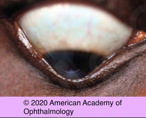
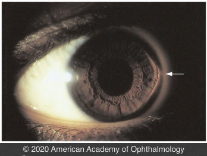

# Keratoconus (KCN)

## Images

## Hierarchy

- Case Description
  - 30-year-old man complains of gradual worsening vision in both eyes
  - Image Description
- Additional Testing
  - keratoscopy
    - steep irregular egg-shaped mires
      - KCN
  - keratometry
    - irregular astigmatism
      - inability to superimpose the circular mires
    - Inferior steepening
      - comparing measurements obtained with the patient in primary gaze to those in upgaze
  - corneal topography
    - inferior steepening
      - KCN
    - inferior steepening with lobster claw pattern
      - PMD
        - inferior keratoconus has a similar appearance!
    - central steepening
      - KGB
  - pachymetry
    - paracentral thinning
      - KCN
        - in KCN, the cornea protrudes at the point of maximal thinning, typically just below the center
    - diffuse thinning
      - KGB
    - peripheral thinning
      - PMD
        - PMD is associated with peripheral thinning and exhibits protrusion central to the area of maximum thinning
  - at times, a clear distinction between pellucid marginal degeneration and keratoconus is not possible
    - keratoconus --> protrusion is at the point of maximal thinning
    - pellucid marginal degeneration --> protrusion is above area of maximum thinning
- Differential Diagnosis
  - keratoconus
    - onset during puberty
      - progression during 2nd, 3rd (and 4th) decades of life
        - angulation of inferior eyelid margin in downgaze (Munson sign)
    - positive family history in 6%–8%
  - pellucid marginal degeneration
    - diagnosis between 20-40 years of age
    - non-hereditary
    - inferior peripheral corneal thinning
  - keratoglobus
    - congenital
    - non-hereditary
    - non-progressive
    - diffuse corneal thinning
    - Ehlers-Danlos syndrome
  - keratectasia after LASIK
    - worsening vision weeks or years after LASIK
- Assessment
  - normal corneal thickness = 540-560 micron
  - KCN
- Treatment
  - Medical
    - treat underlying conditions
      - treat atopic/vernal keratoconjunctivitis
      - treat dry eye
    - optical correction
      - glasses
      - RGPCL
    - hydrops
      - muro 128 drop & ointment
      - cycloplegia
      - aqueous supressants
      - protective glasses/eye-shield
      - intracameral gas
      - fu q 1-4 weeks
  - Surgical
    - corneal cross-linking
    - intracorneal ring segment
      - CL wear
    - partial corneal transplantation
      - for apical scarring
    - full-thickness corneal transplantation
- Data acquistion
  - History
    - onset & course of decreased vision
    - conditions associated with KCN
      - ocular
        - atopic/vernal keratoconjunctivitis
          - eye rubbing
        - floppy eyelid syndrome
        - contact lens wear
        - RP
        - LCA
      - systemic
        - Marfan syndrome
        - Down syndrome
        - mitral valve prolapse
        - Ehlers-Danlos syndrome
        - osteogenesis imperfecta
        - sleep apnea
        - mitral valve prolapse
    - previous LASIK
    - current refractive correction
    - family hx of KCN
  - Physical Exam
    - BCVA
    - streak retinoscopy
      - scissoring
        - early sign
      - irregular astigmatism
    - Rizzutti sign
      - conical reflection on the nasal cornea when a penlight is shone from the temporal side
    - Munson sign
    - SLE
      - vertical tension lines
        - Vogt striae
      - Fleischer ring
      - TM visible without gonioscopy
        - keratoglobus
- Patient Education
  - Avoid
    - avoid eye rubbing
  - Course
    - slow progression
  - Prognosis
    - vision correctable initially with CL
    - excellent prognosis with PK
  - Complications
    - hydrops
    - corneal scarring
  - Follow-up
    - q 6 mo
      - serial topography
