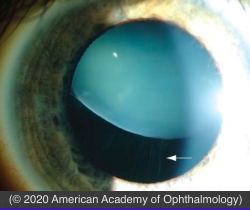

# Lens Subluxation

## Images

## Hierarchy

- Case Description
  - a tall 35-year-old man complains of blurred vision
  - Image Description
    - superior displacement of the lens with stretched zonular fibers
- Additional Testing
  - refraction
    - before dilation
  - sodium nitroprusside test
    - homocystinuria
  - RPR/VDRL
- Differential Diagnosis
  - systemic diseases
    - Marfan
      - AD
      - KCN
      - glaucoma
      - superotemporal lens subluxation
        - bilateral
      - myopia
      - retinal detachment
      - tall stature
      - long fingers
      - kyphoscoliosis
      - aortic dissection/insufficiency
    - homocystinuria
      - AR
      - cystathionine beta synthase deficiency
      - clinical presentation
        - inferonasal subluxation
          - bilateral
        - tall stature
        - light-colored hair
        - seizures
          - unlike Marfan & Weill- Marchesani
        - mental retardation
        - thromboembolic episodes
          - surgery and general anesthesia increase the risk of thromboembolism
      - diet
        - (+) cysteine
        - (+) vitamin B6
        - avoid methionine
    - Weill-Marchesani
      - AR
      - microspherophakia
      - anterior or inferior subluxation
      - pupillary block glaucoma
      - lenticular myopia
      - short stature/fingers
      - no seizure/mental retardation
    - sulfite oxidase deficiency
    - hyperlysinemia
    - syphilis (congenital)
    - Ehlers-Danlos syndrome
  - ocular diseases
    - trauma
    - PXF
    - aniridia
    - hereditary ectopia lentis
    - ectopia lentis et pupillae
- Assessment
  - lens subluxation (Marfan)
- Treatment
  - observe if asymptomatic
  - glasses/contact lenses
  - (clear) lens extraction + intraocular lens
    - indications
      - uncorrectable astigmatism
      - unstable refraction
      - monocular diplopia
      - cataract
  - cataract
    - mydriasis
      - aphakic correction
    - large sector iridectomy away from cataractous lens
      - aphakic correction
    - lens extraction + intraocular lens + anterior vitrectomy
      - in-the-bag
        - capsular support system
      - sulcus
        - scleral fixation
      - anterior chamber
  - laser PI
    - pupillary block
  - Referrals
    - cardiology evaluation
      - cardiomyopathy
        - Marfan
      - aortic aneurysm/dissection/ insufficiency
    - genetic counseling
- Patient Education
  - Prognosis
    - good vision potential
  - Complications
    - retinal detachment
      - Marfan
      - homocystinuria
      - review RD warning symptoms
    - endocarditis after surgery
      - Marfan
      - prophylactic antibiotics before surgery
    - thromboembolic events from general anesthesia
      - homocystinuria
    - pupillary block glaucoma
      - Weill-Marchesani
  - Follow-up
    - life-long follow-up
- Data acquistion
  - History
    - ocular history
      - symptoms
        - decreased vision
        - monocular diplopia
        - pupillary block glaucoma
      - trauma
    - medical history
      - STDs
      - seizure
      - mental retardation
        - homocystinuria, hyperlysinemia , sulfite oxidase deficiency
    - family history
      - Marfan
      - homocystinuria
      - Weill-Marchesani
  - Physical Exam
    - VA
    - IOP
    - body habitus and systemic findings
      - tall slender body, arachnodactyly
        - Marfan syndrome
      - tall, mental retardation, seizure, light colored hair
        - homocystinuria
      - elastic skin
        - Ehlers-Danlos syndrome
      - short stature, stubby fingers
        - Weill-Marchesani syndrome
      - signs of child abuse
    - slit lamp exam
      - uni- or bilateral
      - direction of subluxation
        - up & out
          - Marfan syndrome
        - down & in
          - homocystinuria
          - Ehlers-Danlos syndrome
          - Weill-Marchesani syndrome
      - iridodonesis
      - phacodonesis
      - lens capsule violation
      - microspherophakia
        - Weill-Marchesani syndrome
      - blue sclera
        - Ehlers-Danlos syndrome
      - pseudoexfoliation
    - dilated funduscopy
      - signs of trauma
        - vitreous/retinal hemorrhage
        - vitreous base avulsion
        - retinal tear/RD
        - commotio retina
      - myopia
      - RRD
        - Marfan syndrome, homocystinuria
