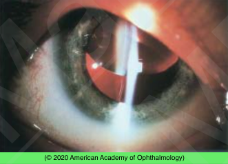
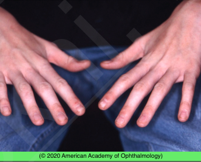

# Lens Subluxation

## Images

## Hierarchy

- Case Description
  - young child with tall stature and long fingers complains of decreased vision of his right eye
    - slit lamp photograph shows upward subluxation of the lens
  - Image Description
- Data acquisition
  - History
    - onset & course of visual symptoms
      - decreased vision
      - monocular diplopia
    - eye trauma
    - child abuse
    - family history
  - Physical Exam
    - VA
    - IOP
    - signs of child abuse
    - uni- or bilateral
    - systemic findings
      - tall slender body, arachnodactyly
        - Marfan syndrome
      - tall, mental retardation, seizure, light colored hair
        - homocystinuria
      - elastic skin
        - Ehlers-Danlos syndrome
      - short stature, stubby fingers
        - Weill-Marchesani syndrome
    - slit lamp exam
      - blue sclera
        - Ehlers-Danlos syndrome
      - direction of subluxation
        - up & out
          - Marfan syndrome
        - down & in
          - homocystinuria
          - Ehlers-Danlos syndrome
      - microspherophakia
        - Weill-Marchesani syndrome
      - pseudoexfoliation
      - lens capsule violation
    - dilated funduscopy
      - signs of trauma
        - vitreous/retinal hemorrhage
        - retinal tear/RD/vitreous base avulsion
        - commotio retina
      - myopic retinopathy
      - RD
    - refraction
      - before dilation
- Additional Testing
  - sodium nitroprusside test
    - homocystinuria
- Assessment
  - Marfan syndrome
- Differential Diagnosis
  - Marfan syndrome
    - AD
    - lens subluxated superiorly and temporally
      - bilateral
        - examination shows long and slender fingers
    - tall stature
    - long fingers
    - kyphoscoliosis
    - increased risk of RD
  - homocystinuria
    - AR
    - inferonasal lens subluxation
      - bilateral
    - increased risk of RD
    - tall
    - light-colored hair
    - seizures
    - mental retardation
      - can be excluded in absence of mental retardation
    - thromboembolic episodes
      - surgery and general anesthesia increase the risk of thromboembolism
      - anticoagulant prophylaxis
    - diet
      - methionine restriction
      - vitamin B6 & cysteine supplementation
  - Weill-Marchesani syndrome
    - AR
    - small lens
      - microspherophakia
        - PALMaR (Peters, Alport, Lowe, Marfan, Rubella) + Weill-Marchesani
    - short stature/fingers
    - lenticular myopia
    - no mental retardation
    - prophylactic peripheral iridotomy
  - Ehlers-Danlos syndrome
    - AD>AR
  - congenital syphilis
  - ocular diseases
    - trauma
      - child abuse
    - PXF
    - aniridia
    - hereditary ectopia lentis
    - ectopia lentis et pupillae
- Treatment
  - observation
    - if asymptomatic
      - good vision
      - no diplopia
      - no capsular violation
  - non-surgical
    - monocular diplopia
      - miosis + phakic correction
    - cataract
      - mydriasis + aphakic correction
  - surgical
    - lens extraction + intraocular lens + anterior vitrectomy
      - indications
        - uncorrectable astigmatism
        - unstable refraction
        - monocular diplopia
        - capsular violation
        - cataract
      - IOL location
        - in-the-bag
          - capsular support system
        - sulcus
          - scleral fixation
        - anterior chamber
    - cataract
      - large optical iridectomy+ aphakic correction
      - surgical removal of lens
    - pupillary block
      - laser PI
    - anticoagulant prophylaxis for homocystinuria
  - Referrals
    - genetic consultation
    - consult with internist/pediatrician for systemic evaluation
    - refer Marfan patients to cardiologist
      - cardiac echo for aortic valve involvement/aortic aneurysm
- Patient Education
  - Prognosis
    - good prognosis with appropriate treatment
  - Complications
    - prophylactic systemic antibiotics before surgery
    - retinal detachment
      - homocystinuria
        - review RD warning symptoms
      - Marfan's
      - trauma
  - Follow-up
    - life-long follow-up
