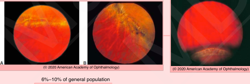
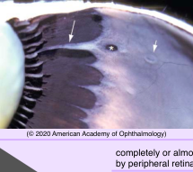
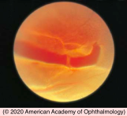
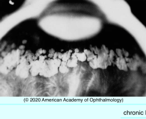
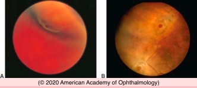
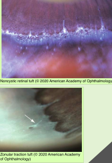

# Lesions That Predispose Eyes to Retinal Detachment

## Images

## Hierarchy

- Meridional Folds, Enclosed Ora Bays, and Peripheral Retinal Excavations
  - Meridional fold
    - radially oriented, prominent thickening of retinal tissue extending into pars plana
      - looks like exaggerated dentate process
      - usually superonasal
    - tears associated with PVD may occur at most posterior limit of meridional folds
    - meridional complex
      - meridional fold aligned with a ciliary process
  - Enclosed ora bays
    - oval islands of pars plana epithelium immediately posterior to ora serrata
      - completely or almost completely surrounded by peripheral retina
    - retinal tears can occur at or near the posterior margins of enclosed ora bays
  - Peripheral retinal excavations
    - mild form of lattice degeneration
    - may have firm vitreoretinal adhesions
    - tears may occur at site of peripheral retinal excavations
    - adjacent to, or up to 4 disc diameters posterior to, ora serrata
- Lattice Degeneration
  - Introduction
    - 6%–10% of general population
    - bilateral in 1/3 - 1/2
    - more common in myopic eyes
    - familial predilection
  - histologic features
    - atrophy and irregularity of the inner retina
    - overlying pocket of liquefied vitreous
    - condensation & adherence of vitreous at margins
  - may predispose to retinal break & detachment
    - present in 20%–30% of eyes with RRD
    - when lattice degeneration is the cause of retinal detachment
      - tractional tear at lateral or posterior margin of the lattice
      - atrophic hole within lattice
        - less common
        - in young patients with myopic eyes and no vitreous detachment
        - generally asymptomatic until fixation is involved
    - prophylactic laser treatment is not universally recommended
- Lesions That Do Not Predispose Eyes to Retinal Detachment
  - Paving-Stone Degeneration
    - “cobblestone degeneration”
    - 22% after age 20 years
    - Histology
      - atrophy of RPE and outer retinal layers
      - adhesions between remaining neuroepithelial layers and Bruch membrane
      - attenuation or absence of choriocapillaris
    - peripheral, small, discrete areas of atrophy of the outer retina
      - singly or in groups
        - ± confluent
      - inferior quadrants
      - anterior to equator
      - yellowish white
      - large choroidal vessels are visible beneath the lesions
      - ± rim of hypertrophic RPE
  - Retinal Pigment Epithelial Hyperplasia
    - Pathogenesis
      - chronic low-grade traction
    - Histology
      - RPE proliferation
    - Clinical
      - diffuse RPE hyperplasia may straddle the ora serrata
        - corresponds roughly to insertion of vitreous base
      - focally on pars plana and peripheral retina
        - areas of focal traction
          - vitreoretinal tufts
          - lattice degeneration
      - previous inflammation
      - trauma
  - Retinal Pigment Epithelial Hypertrophy
    - degenerative change associated with aging
      - commonly in the periphery
      - reticular pattern
        - similar to CHRPE
    - Histology
      - large cells and spherical melanin granules
  - Peripheral Cystoid Degeneration
    - Typical peripheral cystoid degeneration
      - zones of microcysts in the fa rperipheral retina
      - all adults over age of 20 years
      - retinal holes may form
        - rarely cause retinal detachment
    - Reticular peripheral cystoid degeneration
      - almost always posterior to typical peripheral cystoid degeneration
      - inner retina
      - linear or reticular pattern that follows the retinal vessels
      - 20% of adults
      - may develop into reticular degenerative retinoschisis
- Vitreoretinal Tufts
  - pathogenesis
    - vitreous or zonular attachment and traction
  - histology
    - small, peripheral, focal areas of elevated glial hyperplasia
    - ± surrounding RPE hyperplasia
  - types
    - noncystic retinal tufts
    - cystic retinal tufts
    - zonular traction retinal tufts
      - firm vitreoretinal adhesions
        - may predispose to retinal tears and detachment
