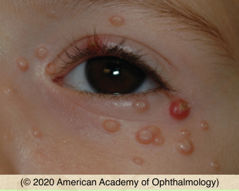
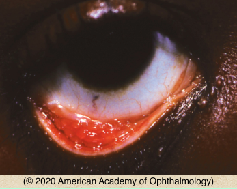

# Molluscum Contagiosum

## Images

## Hierarchy

- Case Description
  - 10-year-old boy with multiple small nodular skin lesions around his left eye
  - Image Description
- Assessment
  - molluscum contagiosum
- Additional Testing
  - HIV serology
    - if multiple lesions
- Differential Diagnosis
  - molluscum contagiosum
    - spreads by direct contact
      - multiple waxy and nodular skin lesions with central umbilication
    - children
    - multiple small papules with central umbilication
    - chromic follicular conjunctivitis
  - BCC
  - nevus
- Treatment
  - Medical
    - eye lubrication
    - observation
  - Surgical
    - unroofing & curettage
      - send for pathologic evaluation
    - cryo
    - cautery
      - extraocular lesions
    - laser
- Patient Education
  - Prognosis & Complications
    - good prognosis
      - resolution of symptoms spontaneously or after excision
      - spontaneous resolution can take months to years
- Data acquisition
  - History
    - onset & course of symptoms
      - chronic ocular irritation
    - other skin lesions
    - if multiple
      - immunodeficiency
        - AIDS
        - chemotherapy
        - chronic steroid use
  - Physical Exam
    - basal cell carcinoma
      - more telangiectasia
      - nodular border
      - central crater
      - lash loss
    - follicular conjunctivitis
    - corneal pannus
