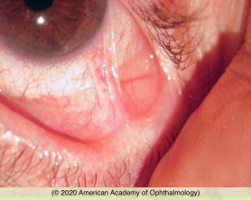

# Mucous Membrane Pemphigoid (MMP)

## Images

## Hierarchy

- Case Description
  - 65-year-old woman complains of dryness, burning, and foreign body sensation of both eyes
  - Image Description
- Data acquisition
  - History
    - onset & course
      - acute vs chronic
      - acute
        - SJS
      - chronic
        - MMP
    - prior acute severe systemic disease
      - SJS
    - systemic medications
    - trauma/surgery/chemical injury
    - conjunctivitis
    - radiation
    - ocular rosacea/blepharitis
    - long-term topical medication use
  - Physical Exam
    - lid position
      - entropion
      - trichiasis
      - lid margin keratinization
    - slit lamp exam
      - active conjunctival inflammation
      - forniceal foreshortening
      - inferior symblepharon
      - tear film
      - corneal health
        - SPK
        - corneal filaments
        - corneal ulcer
        - corneal opacity, keratinization
    - skin & mucous membrane examination
- timolol
  - pilocarpine
    - echothiophate iodide
  - epinephrine
  - idoxuridine
- Additional Testing
  - biopsy of conjunctiva or other involved mucous membrane
    - direct immunofluorescence
- Assessment
  - MMP
- Differential Diagnosis
  - Mucous membrane pemphigoid
    - insidious onset
      - remissions & exacerbations
        - foreshortening and symblepharon of inferior fornix
    - .>60 years
    - dryness, redness, FB sensation, tearing, burning
    - bilateral
    - inferior symblepharon
    - systemic disease
      - vagina, oropharynx, esophagus, anus, urethra
    - Complications
      - conjunctival scarring
      - keratinization of the eyelid margins
        - an important risk factor for poor long-term outcomes
      - trichiasis
      - entropion
      - tear deficiency
      - corneal complications
      - higher risk of infection
    - pseudopemphigoid
      - long-term use of certain topical ophthalmic medications
        - demecarium bromide
      - disease progression ceases after the offending agent is discontinued
  - autoimmune/allergic
    - Steven-Johnson syndrome (SJS)
      - acute
      - epidemiology
        - children and young adults
        - F>M
        - AIDS patients are at a higher risk
      - precipitated by
        - drugs
          - sulfonamides
          - PCN
          - other antibiotics
          - NSAIDs
          - anticonvulsants
            - phenytoin
              - 100 drugs of various classes
          - allopurinol
        - infectious diseases
          - herpes simplex virus
          - adenovirus
          - streptococcus
          - mycoplasma
    - atopic keratoconjunctivitis
    - ocular rosacea
    - sarcoidosis
    - scleroderma
    - graft-vs-host disease
      - after allogeneic bone marrow transplantation
    - lupus
    - lichen planus
  - postinfectious
    - adenoviral conjunctivitis
      - EKC
    - trachoma
    - beta-hemolytic streptococcal conjunctivitis
  - toxic keratoconjunctivitis
    - long-term use of certain topical ophthalmic medications
      - demecarium bromide
  - surgery/trauma/chemical injury
  - radiation
  - linear IgA deficiency
    - can result in an ocular syndrome that is clinically identical to MMP
- Treatment
  - Medical
    - mild disease
      - dapsone
        - initial drug of choice in mild cases
        - avoid in patients with
          - sulfa allergy
            - glucose-6-phosphate dehydrogenase (g6pd) deficiency
    - severe disease
      - immunosuppressive agents
        - cyclophosphamide
          - mainstay of therapy in severe disease
          - target white blood cell count of 2000–3000 cells/μl
        - MTX
        - azathioprine
      - oral steroid
      - topical steroid
        - for exacerbations
    - treat underlying conditions
      - treat underlying blepharitis/ rosacea
      - treat dry eye
        - preservative-free artificial tears & ointment
        - punctal occlusion
          - higher rate of spontaneous extrusion of silicone punctal plugs
        - moisture chamber goggles
    - oral lesions
      - refer for evaluation and biopsy
  - Surgical
    - surgical correction of
      - trichiasis
      - entropion
    - mucous membrane or amniotic membrane grafting
    - keratoprosthesis
  - refer to
    - dermatology
    - ENT
    - GI
- best performed when inflammation absent
  - can cause disease flare up & additional scarring
- Patient Education
  - Course
    - remissions & exacerbations
  - Follow-up
    - every 4 weeks for acute disease
      - q 1-6 months when in remission
- timolol
  - pilocarpine
    - echothiophate iodide
  - epinephrine
  - idoxuridine
