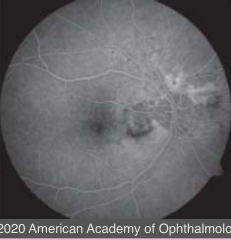
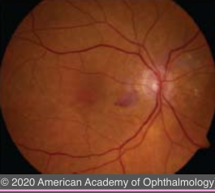
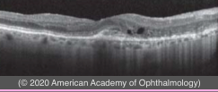
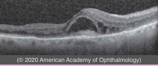
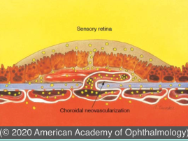
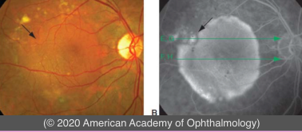
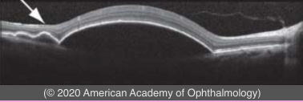

# Neovascular AMD (I)

## Images

## Hierarchy

- symptoms
  - sudden onset
    - decreased vision
    - metamorphopsia
    - central/paracentral scotoma
      - Amsler grid highly effective for early detection
- clinical findings
  - subretinal fluid
  - subretinal/sub-RPE blood
  - subretinal/intraretinal lipid exudate
    - ± massive exudation
      - intraretinal hemorrhage may be an early sign of retinal angiomatous proliferation (RAP)
      - exudative RD
  - subretinal pigment ring
  - irregular elevation of RPE
  - subretinal gray-green/gray-white lesion (CNV)
  - cystoid macular edema
  - sea fan pattern of subretinal small vessels
  - PED
    - serous
    - hemorrhagic
  - RPE tear
- after treatment
- fluorescein patterns
  - classic CNV
    - type 2 neovascularization
    - bright, lacy
    - well-defined
    - appears in early phase
    - progressive leakage
      - obscures the boundaries
    - before treatment
  - occult CNV
    - type 1 neovascularization
    - types
      - 1. PED
        - • fibrovascular PED
          - irregular RPE elevation
            - best seen on stereo photos
          - progressive stippled leakage on FA
            - 1-3 minutes after injection
            - not as diffuse as classic CNV
            - irregular/nonhomogeneous
          - consistent with a serous PED
        - • vascularized serous PED
          - has a notch, or hot spot, due to a vascular component
            - rapid pooling of dye in a homogenous ground-glass pattern
      - 2. late leakage of undetermined source
  - RAP
    - focal hot spot on FA and indocyanine green (ICG) angiography
      - poorly defined in the early phases but better appreciated in late phases
    - late CME or pooling into a PED
  - hypofluorecence
    - thick blood, pigment, scar tissue, or a PED may block fluorescence
- anatomical types of CNV
  - type 1
    - originate from choriocapillaris
      - between Bruch membrane & RPE
    - grow through a defect in Bruch membrane into sub–RPE space
      - vascularized serous PED
      - fibrovascular PED
        - irregular surface contour
    - usually occult
  - type 2
    - between RPE & neurosensory retina
    - lacy or gray-green lesion
    - less common than type 1
    - usually classic
  - type 3
    - originate from deep capillary plexus of retina
    - grow downward toward RPE
    - intraretinal
      - "retinal angiomatous proliferation"
    - small area of red discoloration + retinal exudate or a bleb of subretinal fluid
- ICG angiography
  - penetrates deeper through hemorrhage or pigment to reveal a hot spot that identifies CNV
  - can differentiate between scar tissue and serous PED
