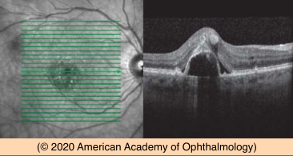
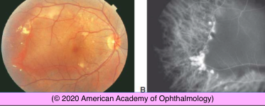
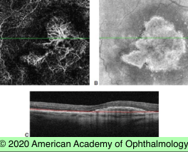
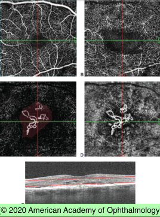
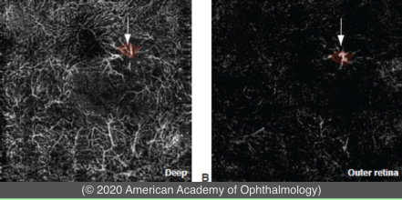

# Neovascular AMD (II)

## Images

## Hierarchy

- SD-OCT of CNV
  - type 1 CNV
    - elevation of the RPE and PEDs
    - serous PED
      - sharply elevated, dome-shaped with hollow internal reflectivity
        - typically no associated subretinal or intraretinal fluid
    - fibrovascular PEDs
      - may or may not be sharply elevated and typically demonstrate lacy or polyp-like hyperreflective lesions on undersurface of RPE
      - ± signs of contraction
    - chronic fibrovascular PEDs
      - multilayered appearance due to sub-RPE cholesterol crystal precipitation in an aqueous environment
        - “onion” sign
    - fibrotic “bridge arch–shaped” serous PED
      - can develop following anti-VEGF treatment
      - poor visual outcome
  - Type 2 CNV
    - hyperreflective band/plaque in subneurosensory space
      - associated subretinal and/or intraretinal fluid
  - Type 3 CNV
    - hyperreflective foci emanating from the deep capillary plexus
      - ± associated CME and PED
  - Subretinal hyperreflective material (SHRM)
    - between retina and RPE in eyes with CNV
    - has an adverse effect on visual acuity
      - results in scarring
- Polypoidal choroidal vasculopathy
  - variant of type 1 CNV
  - women and men of all races
    - Asians
      - 20%–50% of neovascular AMD
    - whites
      - <5% of neovascular AMD
  - Clinical
    - multiple, recurrent serosanguineous RPE detachments
      - often peripapillary
      - may be peripheral
    - ± nodular, orange, subretinal lesions
    - vitreous hemorrhage
      - occurs more frequently with PCV than non-PCV AMD
    - ± soft drusen
  - Diagnostic testing
    - ICG angiography
    - OCTA
    - SD-OCT
      - network of polyps associated with feeder vessels that adhere to RPE monolayer of fibrovascular PED
        - “string-of-pearls” configuration
    - EDI-OCT
      - pachychoroid
  - natural history
    - visual acuity outcomes of PCV better than CNV associated with AMD
      - except with severe subretinal hemorrhage
  - Treatment
    - less responsive to anti-VEGF therapy than other types of CNV
    - Everest Studies
      - PDT ± ranibizumab better than ranibizumab alone
- OCT Angiography of CNV
  - type 1
  - type 2
  - type 3
- differential diagnosis
  - central serous chorioretinopathy
    - younger patient
    - no subretinal hemorrhage
    - thick choroid in eyes with CSC compared to thin choroid in AMD
    - geographic patches of RPE mottling that may extend to inferior periphery
      - “guttering”
    - multiple PEDs
  - retinal arterial macroaneurysms
    - preretinal/intraretinal/subretinal hemorrhage
    - subretinal hemorrhage surrounds the aneurysm
    - FA & ICGA may show the macroaneurysm
  - vitelliform dystrophy
    - adult vitelliform dystrophy
      - may resemble
        - PED
        - large confluent drusen
    - vitelliform macular dystrophy
      - visual acuity remains relatively good
      - vitelliform material shows
        - early blockage
        - late staining
  - polypoidal choroidal vasculopathy
    - all races
    - both F & M
    - multiple/recurrent serosanguinous PEDs
      - peripapillary
      - orange
      - nodular
    - vitreous hemorrhage
      - more frequently than in AMD
    - soft drusen not usually present
    - better visual acuity outcomes than those of AMD
  - inflammatory conditions
    - VKH syndrome
    - posterior scleritis
    - SLE
  - choroidal tumors
    - small choroidal melanoma
    - choroidal hemangioma
