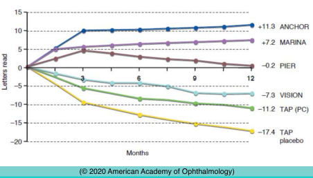

# Neovascular AMD (III): Management (I): Antiangiogentic Therapies

## Images

## Hierarchy

- Angiogenesis
  - Angiogenesis cascade
    - vasodilation of existing vessels
    - increased vascular permeability of existing vessels
    - degradation of surrounding extracellular matrix
    - migration and proliferation of endothelial cells
    - endothelial cells join to create lumen
    - new capillaries develop and mature
  - Activators of angiogenesis
    - vascular endothelial growth factor(VEGF)
      - homodimeric glycoprotein
      - has a heparin-binding growth factor specificity for vascular endothelial cells
      - functions
        - lymphangiogenesis
        - angiogenesis
        - increased vascular permeability
        - prevents endothelial cell apoptosis
      - role in AMD
        - increases in RPE cells in early stages of AMD
        - high concentrations in excised CNV
        - high concentration in vitreous of eyes with AMD
      - 4 major VEGF isoforms
        - VEGF165 is the most dominant in AMD
    - fibroblast growth factor (FGF)
    - transforming growth factor α (TGF-α)
    - TGF-β
    - angiopoietin-1
    - angiopoietin-2
  - Inhibitors of angiogenesis
    - thrombospondin
    - angiostatin
    - endostatin
    - pigment epithelium–derived factor (PEDF)
- Antiangiogenic Therapies
  - Anti-VEGF dosing intervals
    - fixed interval
      - monthly
        - ranibizumab
        - MARINA & ANCHOR studies
          - loss of fewer than 15 ETDRS letters
            - 95% of ranibizumab-treated patients
            - 62% of sham-treated patients and
              - at 12 months
            - 64% of PDT-treated patients
          - improvement of ≥15 letters
            - 30%–40% of ranibizumab-treated patients
            - ≤ 5% in the control participants
              - at 24 months
          - 90% of ranibizumab-treated eyes lost < 15 ETDRS letters
      - q 3 month
        - ranibizumab
        - EXCITE & PIER studies
          - improvements (similar to MARINA and ANCHOR studies) over the first 3 months
          - treatment effects declined in participants undergoing quarterly (every 3 months) dosing as opposed to monthly dosing
            - quarterly treatment is suboptimal
    - “as-needed”
      - dosing
        - regular monthly treatment until macula is dry
        - resume injections only when signs of recurrent exudation appear
          - ranibizumab
      - studies
        - PrONTO
        - SAILOR
          - 3 monthly injections, followed by various as-needed regimens
        - SUSTAIN
        - HORIZON
        - all of these studies had vision and OCT outcomes comparable to or reduced compared to MARINA and ANCHOR
        - in HORIZON study patients lost ≈ 8 letters once regimen was switched from monthly injections to as-needed
    - “treat and extend”
      - regular monthly treatment until macula is dry
      - treatment continues at progressively increasing intervals
  - Treatment effect modifiers
    - vitreoretinal interface status
      - hyaloidal separation
        - facilitates drug penetration
        - fewer injections needed
        - VA is not affected
      - epiretinal membrane
        - more injections needed
  - Complications
    - minor ocular complications
      - local irritation
      - subconjunctival hemorrhage
        - common
    - rare
    - serious ocular complications
      - vitreous hemorrhage
      - retinal detachment
      - persistent ocular hypertension
      - inflammation
      - endophthalmitis
        - ≤ 1/2000
      - RPE tear
        - anti-VEGF therapy in eyes with fibrovascular PED
          - especially for PEDs > 600 μm in height
        - contraction of underlying type 1 CNV
    - systemic complications
      - systemic administration of bevacizumab increases risk of
        - hypertension
        - thromboembolic events
          - MI & CVA
            - conflicting evidence whether intravitreal injections increase the rate of these complications
        - GI perforations and bleeding
- Antiangiogenic Agents
  - Pegaptanib
    - RNA oligonucleotide ligand (or aptamer)
    - binds human VEGF165
  - Ranibizumab
    - recombinant humanized antibody fragment (Fab)
    - binds to and inhibits all active isoforms of VEGF-A as well as their active degradation products
    - HARBOR
      - compared higher-dose (2.0 mg) with standard-dose (0.5 mg)
      - found no difference in visual acuity or anatomical outcomes between higher-dose and standard-dose
  - Bevacizumab
    - full-length monoclonal antibody against VEGF
    - used “off-label” for the treatment of AMD
    - clusters of severe vision loss due to endophthalmitis
      - secondary to substandard and erroneous compounding practices
    - comparison
      - bevacizumab
        - larger
        - 2 antigen-binding domains
        - longer systemic half-life after intravitreal injections
          - ~21 days
        - costs substantially less
          - 40x lower
      - ranibizumab
        - smaller
        - single doma
        - shorter systemic half-life after intravitreal injections
          - 2.2 hours
    - CATT
      - bevacizumab was noninferior to ranibizumab therapy in monthly or as-needed delivery schedules over 2 years
      - systemic adverse events were significantly greater in bevacizumab (39.9%) than in ranibizumab (31.7%) group
      - death and arteriothrombotic events were not statistically different
      - geographic atrophy development or increase appeared to be stimulated by anti-VEGF therapy
  - Aflibercept
    - ligand-binding elements of extracellular domains of VEGFR1 and VEGFR2 fused to constant region (Fc) of IgG
    - binds both VEGF and placental-like growth factor
    - fully penetrates all retinal layers
    - VIEW 1 and VIEW 2 studies
      - all aflibercept regimens demonstrated noninferiority to ranibizumab monthly regimen
      - after 3 monthly doses, aflibercept administered every 2 months showed similar efficacy to ranibizumab administered monthly
      - safety profiles were similar for both aflibercept and ranibizumab
        - patients receiving monthly aflibercept (2 mg) gained 10.9 letters of visual acuity, whereas those receiving monthly ranibizumab (0.5 mg) gained 8.1 letters (P< .01)
