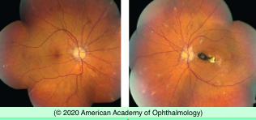
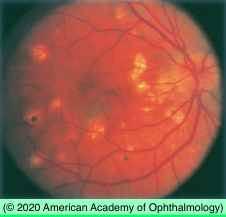
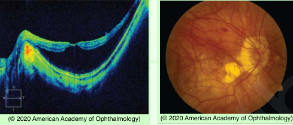
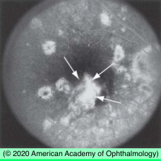

# Neovascular AMD (V): Other Causes of CNV

## Images

## Hierarchy

- Conditions Associated with CNV
  - Degenerative
    - AMD
    - myopic degeneration
    - angioid streaks
  - Heredodegenerative
    - vitelliform maculpathy
    - fundus flavimaculatus
    - optic disc drusen
  - Inflammatory
    - ocular histoplasmosis syndrome
    - multifocal choroiditis
    - serpiginous-like choroiditis
    - toxoplasmosis
    - toxocariasis
    - rubella
    - VKH
    - Behcet disease
    - sympathetic ophthalmia
  - Tumor
    - choroidal nevus
    - choroidal hemangioma
    - choroidal metastasis
    - RPE hamartoma
  - Trauma
    - choroidal rupture
    - intense photocoagulation
  - Idiopathic
- Angioid streaks
  - clinical
    - irregular dark red or brown lines radiating from a ring of peripapillary atrophy surrounding the optic disc
  - fluorescein angiography
    - hyperfluorescent window defects with late staining
    - not necessary for diagnosis
    - to rule out CNV
  - histology
    - breaks in thickened calcified Bruch's membrane
  - predisposing conditions
    - pseudoxanthoma elasticum
      - autosomal recessive
        - ABCC6 gene mutation
          - 16p13.1
      - clinical
        - angioid streaks
        - optic disc drusen
        - peripheral round atrophic scars with “comet” sign
        - lighter orange fundus
        - peau d'orange appearance
          - mottled RPE appearance
        - calcific coronary arteriosclerosis
        - plucked chicken skin
        - GI & CNS bleeding
    - Paget disease of bone
    - beta thalassemia
    - sickle cell anemia (SS)
    - Ehlers-Danlos syndrome
    - elderly patients
  - usually asymptomatic
  - visual complications
    - submacular dhemorrhage without CNV
      - resolve spontaneously
    - CNV
      - exudative macular detachment
  - treatment
    - anti-VEGF agents
      - for CNV
    - safety glasses
      - minor blunt injury can cause choroidal rupture
    - medical consultation
      - refer patients with new diagnosis of angioid streaks and no known systemic diseases for systemic work-up
- Ocular Histoplasmosis Syndrome
  - Histoplasma capsulatum fungus
    - endemic to the Mississippi and Ohio River valleys
    - humans become infected by inhaling the yeast form
      - carried on
        - feathers of
          - chickens
          - pigeons
          - blackbirds
        - bat droppings
      - disseminates throughout the bloodstream
    - organism has been identified histologically in choroid of patients with OHS
  - Demographics
    - OHS more prevalent among populations with higher % of positive skin reactors
    - > 90% of patients with OHS react positively to histoplasmin skin testing
    - in 1 community with endemic histoplasmosis (60% positive skin test), the
      - peripheral lesions of OHS in
        - 2.6% of total population
        - 4.4% of positive skin test responders
      - only 1 individual with peripheral lesions showed disciform macular disease
  - Clinical
    - asymptomatic until development of CNV
    - > 60% bilateral
    - small, atrophic, “punched-out” chorioretinal scars in midperiphery and posterior pole (“histo spots”)
    - linear peripheral atrophic tracks
    - juxtapapillary chorioretinal scarring
    - ± macular CNV
      - risk of visual loss in fellow eye if 1 eye has CNV/disciform scarring
        - normal fellow eye
          - 1%
        - peripapillary atrophy in fellow eye
          - 4%
        - macular histo spots in felow eye
          - 25%
    - absence of vitreous inflammation
  - Differential diagnosis
    - multifocal choroiditis
    - birdshot choroidopathy
    - APMPPE
    - diffuse unilateral subacute neuroretinopathy (DUSN)
  - Management
    - no medical treatment
    - anti-VEGF therapy for CNVM
- Pathologic myopia
  - incidence of CNV develops 5-10% of eyes with axial length >26.5 mm
    - with or without
      - widespread chorioretinal degeneration
      - lacquer cracks
  - Treatment
    - laser photocoagulation
      - laser scar may expand through the foveal center over time
        - atrophy creep
    - PDT
      - has been shown to be beneficial
      - FDA approved
      - VIP Pathologic Myopia Trial
        - PDT prevented (mild & moderate) visual loss up to 3 years
    - anti-VEGF agents
      - mainstay of treatment
      - sustained regression of myopic CNV
      - stabilization or improvement of visual acuity after only 1 or 2 injections
