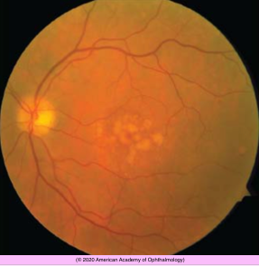
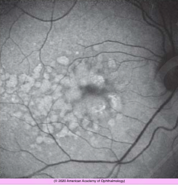
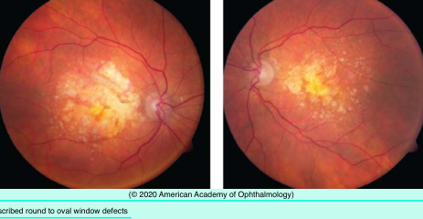
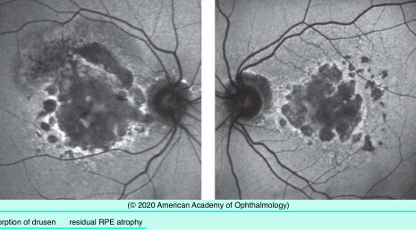

# Nonneovascular AMD (I)

## Images

## Hierarchy

- Introduction to AMD
  - Normal aging changes in the macula
    - reduction in density & distribution of photoreceptors
    - RPE changes
      - loss of melanin granules
      - formation of lipofuscin granules
      - accumulation of residual bodies
    - accumulation of basal laminar/linear deposits
      - granular lipid-rich material
      - widely spaced collagen fibers
        - between plasma membrane of RPE cells and inner collagenous layer of Bruch membrane on either side of basement membrane of RPE
    - involutional changes in the choriocapillaris
  - Demographics of AMD
    - leading cause of blindness in the developed world after age 50
    - North America
      - “dry” (nonneovascular, or non-exudative) AMD
        - 11 million (85%–90%)
      - “wet” (neovascular) AMD
        - 1.5 million (10%–15%)
        - 71,000 new cases each year
    - risk factors for AMD
      - age
        - .>65 years
          - 10%
        - .>75 years
          - 25%
      - female sex
      - hypertension
      - hypercholesterolemia
      - cardiovascular disease
      - higher waist-to-hip ratio in men
      - positive family history
      - cigarette smoking
      - elevated levels of C-reactive protein and other inflammatory markers
      - hyperopia
      - light iris color
      - race
        - lowest in African Americans (2.4%)
        - intermediate in Hispanics (4.2%) and Asians (4.6%)
          - Multi-Ethnic Study of Atherosclerosis (MESA)
        - highest in whites (5.4%)
  - Genetics of AMD
    - genetic mutations responsible for AMD affect various biochemical pathways
      - alternate complement pathway
        - CFH, CFI, C2/CFB, C3, and C7
      - lipid transport and metabolism
        - APOE
      - modulation of the extracellular collagen matrix
        - COL8A1, COL10A1, TIMP3
      - clearance of all-trans-retinaldehyde from photoreceptors
        - ABCA4
      - angiogenesis
        - MMP9, VEGFA
    - 2 major susceptibility genes for AMD
      - CFH (1q31)
        - codes for complement factor H
        - CFH Y402H mutation increases risk for AMD
          - 4.6-fold when heterozygous
          - 7.4-fold when homozygous
      - ARMS2 (10q26)
        - gene product and function are poorly understood
        - ARMS2 A69S mutation increases risk for AMD
          - 2.7-fold when heterozygous
          - 8.2-fold when homozygous
        - ARMS2/HTRA1 and MMP20 are associated with CNV lesion size
          - AAO recommends deferring genetic testing until replicable studies have confirmed its value
    - Genetic testing
      - interpretation and usefulness is controversial
      - unhealthy lifestyle increases AMD risk regardless of genotype
      - risk models are poorly validated
      - risk models add little to the risk estimated from clinical findings and non-genetic risk factors
    - Pharmacogenomic testing
      - to predict the optimal pharmacologic or nutritional-supplement interventions for a given patient
      - validation studies are lacking
- Drusen
  - Symptoms
    - typically asymptomatic
    - mild to moderate vision loss
    - decreased contrast sensitivity and color vision
    - impairment of dark adaptation
  - Clinical appearance
    - small, round, yellow lesions
    - along basal surface of RPE
    - postequatorial
  - Size
    - small
      - <63 micron
    - intermediate
      - 63-124 micron
    - large
      - ≥125 micron
    - drusenoid PED
      - .>350 micron
    - risk of progression to advanced AMD after 5 years (AREDS)
      - stage 2 (early AMD)
        - many small or few intermediate drusen
          - 1.3%
      - stage 3
        - many intermediate drusen or even a single few large druse (stage 3)
          - 18%
  - Boundaries
    - hard
      - discrete and well demarcated
      - well-defined focal areas of lipidization or hyalinization of the RPE– Bruch membrane complex
    - soft
      - amorphous and poorly demarcated
      - basal linear deposits
      - more likely to progress to atrophy or CNV
    - confluent
      - contiguous drusen without clear boundaries
      - ± more likely to progress to atrophy or CNV
- RPE abnormalities
  - focal hyperpigmentation
    - FA
      - blockage
    - SD-OCT
      - hyperreflective outer retinal foci
    - incidence increases with age
    - increased risk of progressing to advanced AMD
  - focal atrophy
    - noncontiguous pigment mottling or RPE atrophy
  - geographic atrophy
    - contiguous RPE atrophy
      - .> 175 μm
    - clinical findings
      - increased visibility of underlying choroidal vessels
      - thinning of overlying retina
      - attenuation of underlying choriocapillaris
      - gradual enlargement
        - ≈1.79 mm2/year
        - often spares the fovea until late
          - 10% of patients with AMD and a VA of ≤20/200 have GA
      - 12-20% severe vision loss
    - FA
      - well-circumscribed round to oval window defects
    - SD-OCT
      - progressive loss of RPE, overlying inner segment ellipsoid, and photoreceptor layers
    - fundus autofluorescence
      - densely hypoautofluorescent
  - other abnormalities caused by RPE atrophy
    - resorption of drusen
      - residual RPE atrophy
    - dystrophic calcification & lipidization
      - refractile or crystalline appearance
        - “refractile” or “calcific” drusen
    - focal clumps or reticulated hyperpigmentation
      - RPE cells/pigment-laden macrophages migrate to photoreceptor level
