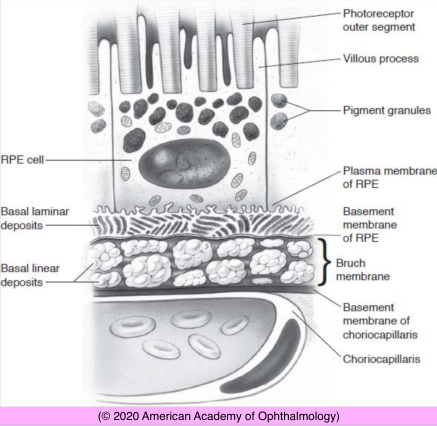
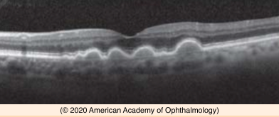
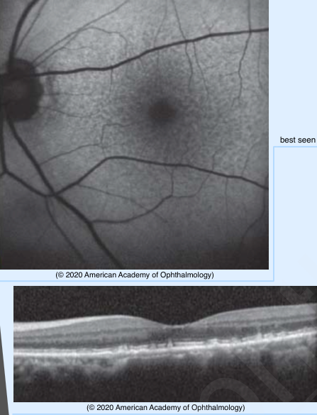
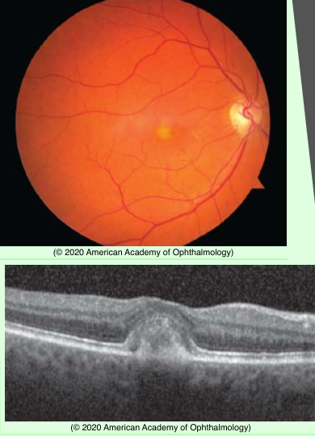

# Nonneovascular AMD (II)

## Images

## Hierarchy

- Ancillary Testing
  - FA
    - hypofluorescence
      - hemorrhage at any level
      - lipid
      - pigment proliferation
    - hyperfluorescence
      - hard & soft drusen
        - small hard drusen
          - early hyperfluorescence
            - window defect
        - larger soft and confluent drusen & drusenoid PEDs
          - slow and homogenous late staining
            - pooling of dye in sub-PED space
      - RPE atrophy
      - RPE tear
      - CNV
      - serous PED
      - subretinal fibrosis
      - laser scars
  - OCT
    - sub-RPE nodular elevations with a notable absence of intraretinal and subretinal fluid
    - choroidal thickness is often reduced in AMD
- Histology
  - basal laminar deposits
    - granular lipid-rich material & widely spaced collagen fibers
      - between plasma membrane (basal lamina) and basement membrane of RPE
  - basal linear deposits
    - phospholipid vesicles & electron dense granules
      - within inner collagenous zone of Bruch membrane
  - large or soft drusen
    - small detachment of thickened inner aspect of Bruch membrane along with the RPE from the rest of Bruch membrane
  - drusenoid PED
    - larger detachment of thickened inner aspect of Bruch membrane along with the RPE from the rest of Bruch membrane
- Differential diagnosis
  - these features may occur in younger individuals (younger than 50 years)
  - CSC
    - RPE changes similar to AMD
    - absence of drusen
    - thickened choroid on EDI-OCT in affected and fellow eye
    - multiple small serous RPE detachments
  - pattern dystrophy
    - younger patient
      - age<50 years
        - normal or thin choroid in eyes with AMD
    - reticular or butterfly-shaped hyperpigmentation of macula
      - symmetrical
  - basal laminar (cuticular) drusen
    - 30s or 40s
    - innumerable round small-large drusen
    - vitelliform yellow material in central macula
    - more visible on FA
      - "starry-night" appearance
  - drug toxicity
    - lack of large drusen
    - specific drug ingestion
      - hydroxychloroquine toxicity
      - deferoxamine
      - cisplatin
      - pentosan polysulfate sodium
  - adult-onset vitelliform maculopathy
    - yellow subretinal lesions beneath the outer retina
    - SD-OCT
      - hyperreflective, dome-shaped central lesion
    - FA
      - early blocked fluorescence with a surrounding zone of hyperfluorescence
      - late staining
- Reticular pseudodrusen or subretinal drusenoid deposits
  - reticular-like network
  - smaller than soft drusen
  - commonly in superior macular region
  - associated with progressive atrophy of photoreceptor layer, GA, and greater risk of CNV
  - best seen on fundus autofluorescence & infrared imaging
  - histology
    - located on apical surface of RPE
    - share some proteins with drusen (eg, apolipoprotein E, complement factor H, and vitronectin)
    - contain different lipids
    - do not contain shed disk remnants
    - SD-OCT
      - above the RPE and beneath the inner segment ellipsoid layer
