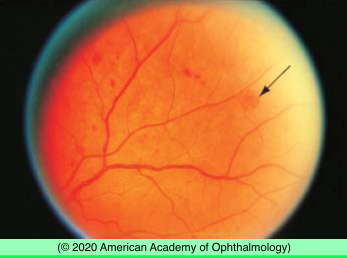
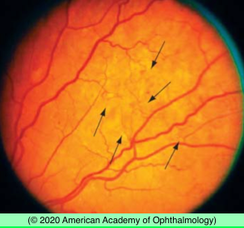
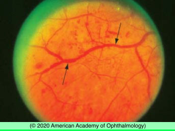

# Nonproliferative Diabetic Retinopathy

## Images

## Hierarchy

- Definition
  - microvascular changes are limited to retina and do not extend beyond ILM
- Clinical findings
  - intraretinal hemorrhages
  - microaneurysms
  - cotton-wool spots
  - intraretinal microvascular abnormalities (IRMAs)
  - dilation and beading of retinal veins
  - retinal capillary nonperfusion
    - common finding in DR, especially in more advanced levels
    - closure of retinal arterioles may result in larger areas of nonperfusion
    - FAZ may appear increasingly irregular & enlarged on FA or OCTA
    - peripheral nonperfusion is frequently seen on ultra-wide-field FA
      - even in eyes with mild NPDR
  - macular edema
    - caused by increased intraretinal vascular permeability
  - peripheral DR changes
    - often present outside of the standard ETDRS fields
    - suggest greater DR severity in ≈ 10% of eyes
    - predominantly peripheral DR lesions may be associated with greater risk of subsequent DR progression
  - 2 mechanisms of visual loss
    - macular edema
    - macular ischemia
- Early Treatment Diabetic Retinopathy Study (ETDRS) findings
  - Focal photocoagulation for DME
    - decreased risk of moderate vision loss (doubling of initial visual angle)
    - increased chance of moderate vision gain (halving of initial visual angle)
    - reduced retinal thickening
  - Early scatter photocoagulation
    - small reduction in risk of severe vision loss (<5/200 for at least 4 months)
    - not indicated for eyes with mild to moderate diabetic retinopathy.
    - may be most effective in patients with type 2 DM
  - Aspirin use
    - did not alter progression of diabetic retinopathy
    - did not increase risk of vitreous hemorrhage
    - did not affect visual acuity
    - reduced risk of cardiovascular morbidity and mortality
      - patient has type 2 diabetesis
        - patient is likely to be nonadherent to recommendations for follow-up or systemic control
- Treatment
  - early treatment with PRP
    - should be considered for severe NPDR or worse, especially if
  - anti-VEGF therapy (for DME)
    - improves DR severity in eyes at all severity levels of NPDR
    - after 2 years of continuous, monthly anti-VEGF injections, ≈ 40% of eyes will improve by ≥2 or more severity levels
  - intravitreal steroid therapy (for DME)
    - improves DR severity level
  - ACCORD and Fenofibrate Intervention and Event Lowering in Diabetes (FIELD) studies
    - fenofibrate treatment in patients with type 2 diabetes reduces DR progression
  - PVD
    - might improve outcomes in diabetic eyes at risk of developing PDR
      - vitreous scaffolding that enables extraretinal neovascular proliferation is removed
    - currently there is no role for surgery in management of NPDR
- NPDR severity levels
  - mild
    - >1 microaneurysm
  - moderate
    - more than “mild” but less than “severe”
  - severe
    - risk of progression to high-risk PDR
      - within 1 year
        - 15%
      - within 3 years
        - 60%
    - has 1 of the “4:2:1 rule” risk factors
      - severe intraretinal hemorrhages and microaneurysms in 4 quadrants
      - definite venous beading in ≥2 quadrants
      - moderate IRMA in ≥1 quadrant
  - very severe
    - has ≥ 2 of the “4:2:1 rule” risk factors
    - risk of progression to high-risk PDR within 1 year
      - 45%
- based on standard photographs from ETDRS
