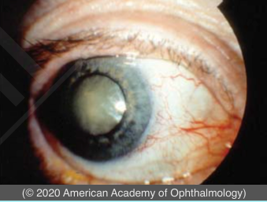
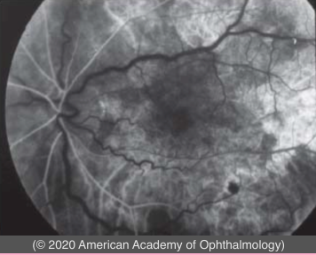
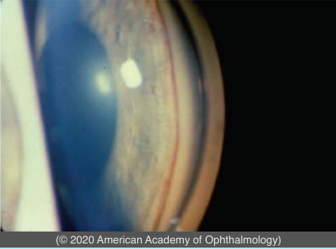
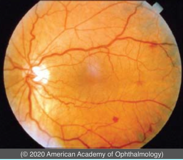

# Ocular Ischemic Syndrome and Carotid Occlusive Disease

## Images

## Hierarchy

- ischemic vascular disease
  - ischemic cardiovascular disease
  - previous CVA
    - 1/4
      - 1/2
      - 1/5
  - severe peripheral atherosclerosis
- Etiology
  - atherosclerosis
  - Eisenmenger syndrome
  - vasculitis
    - giant cell arteritis
      - > 90% obstruction
- Demographics
  - > 55 years
  - 20% bilateral
- Symptoms
  - gradual vision loss
  - aching eye pain
  - prolonged vision recovery after exposure to bright light
- Ancillary testing
  - Fluorescein angiography
    - delayed choroidal filling
      - 60%
    - prolonged AV tran
      - 95%
    - especially arteries
    - vascular staining
      - 85%
  - ERG
    - global amplitude reduction
      - both photoreceptors and inner retina
- Prognosis
  - Visual Prognosis
    - rubeosis irides
      - VA < 20/200 in 90% within 1 year
        - CRVO and CRAO affect only inner retina
  - 5-year mortality
    - 40%
- Signs
  - cataract
  - iris/angle neovascularizartion
    - 2/3
    - (neovascular) glaucoma
      - 1/2
      - normal or low IOP in 1/2 due to impaired aqueous production
  - AC cellular reaction
    - 1/5
  - narrow retinal arteries
  - dilated retinal vein
  - retinal hemorrahges
    - deep
      - not very tortuous
    - round
    - mid peripheral
  - microaneurysms
  - NVE/NVD
    - helps differentiate from CRVO
  - low retinal artery pressure
    - gentle pressure on the eye will collapse central retinal artery
- Treatment
  - carotid reperfusion
    - techniques
      - Carotid artery stenting
        - ineffective if 100% obstruction
      - endarterectomy
      - extracranial to intracranial bypass
        - ineffective for preventing loss of vision or stroke
    - can cause severe rise in IOP
  - PRP
    - results in regression of NVI
      - 2/3
  - anti-VEGF
    - results in regression of NVI
