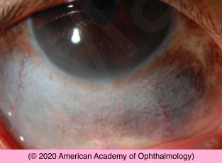

# Ocular Melanocytosis

## Images

## Hierarchy

- Case Description
  - 15-year-old boy with increased pigmentation of his right eye present since birth
  - Image Description
- Additional Testing
  - B-scan if fundus view not adequate
- Differential Diagnosis
  - ocular melanocytosis
    - from birth
      - diffuse episcleral pigmentation with dark brown iris
    - increased pigmentation at puberty
    - 5% bilateral
  - pigment spot of the sclera
    - collection of melanocytes associated with an intrascleral nerve loop or perforating anterior ciliary vessel
  - conjunctival nevus/ melanoma
  - PAM
    - move with conjunctiva
  - CAM
  - uveal melanoma with extraocular extension
- Assessment
  - ocular melanocytosis
- Treatment
  - baseline photos
  - observation
    - monitor for change
- Patient Education
  - Prognosis & Complications
    - glaucoma
      - 10%
    - risk of developing uveal melanoma
      - 1/400 lifetime risk
    - risk of developing extraocular melanoma
      - orbit
      - brain
  - Follow-up
    - q1 year
    - complete eye exam every visit
      - monitor for glaucoma
      - monitor for melanoma
- Data acquistion
  - History
    - time of onset
      - review old photos
    - change in pigmentation
    - race
      - CAM
    - other family members
      - CAM
  - Physical Exam
    - temple pigmentation
    - lid pigmentation
    - palate pigmentation
    - pigmetation
      - flat or raised
      - movement with conjunctiva
        - conjunctival vs. episcleral
          - melanocytosis does not move with the conjunctiva
    - dilated (sentinel) episcleral vessels
      - ciliary body melanoma with extraocular extension
    - IOP
    - slit lamp exam
      - iris pigmentation (melanocytosis)
      - iris melanoma
        - C/D ratio
    - dilated fundus exam
      - choroidal pigmentation (melanocytosis)
      - posterior uveal melanoma
    - examine both eyes
      - CAM and pigment spots of sclera are more likely to be bilateral
  - 10% of patients with ocular melanocytosis can develop secondary glaucoma
