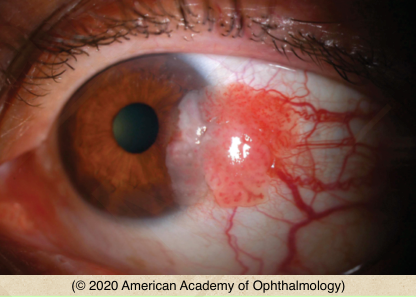
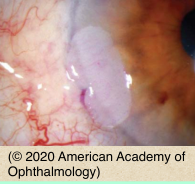
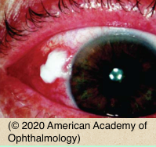
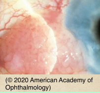

# Ocular Surface Squamous Neoplasia (OSSN)

## Images

## Hierarchy

- Case Description
  - 55-year-old man has noted a raised red spot on the surface of this left eye for the past 3 months
  - Image Description
- Data acquisition
  - History
    - ocular history
      - onset & course
        - slow vs fast
      - diplopia
    - medical history
      - sunlight exposure
      - smoking
      - AIDS/immunodeficiency
        - young patient
        - mutifocal/bilateral OSSN
      - cutaneous cancers
  - Physical Exam
    - intrinsic/feeder vessels
    - leukoplakia
    - corneal involvement
    - adherence to underlying sclera
    - other eye
      - pinguecula/pterygium
    - ocular motility
    - preauricular adenopathy
    - Hertel exophthalmometry
    - gonioscopy
    - other lid/skin lesions
- Additional Testing
  - if intraorbital extension suspected
    - orbital imaging
- Assessment
  - Ocular Surface Squamous Neoplasia (OSSN)
- Differential Diagnosis
  - Ocular Surface Squamous Neoplasia (OSSN)
    - middle aged-elderly
      - red, raised limbal lesion of the conjunctiva with tortuous intrinsic vessels and prominent feeder vessels laterally in the interpalpebral fissure; the lesion extends onto the peripheral cornea with focal overlying leukoplakia
    - uilateral & unifocal
    - types
      - gelatinous
      - leukoplakic
      - papillomatous
    - risk factors
      - ultraviolet light exposure
      - immunosuppression
      - fair complexion
      - smoking
      - HPV infection
      - aging
    - complications
      - corneal invasion
      - intraocular invasion
      - orbital invasion
      - lymph node metastasis
  - inflammed pterygium/ pinguecula
  - papilloma
  - amelanotic nevus/ melanoma
  - sclerokeratitis
- Treatment
  - Medical
    - topical mitomycin
    - topical 5-FU
    - topical/subconjunctival interferon
  - Surgical
    - excisional biopsy
      - no touch technique
      - wide margins
      - corneal epitheliectomy
      - double freeze thaw cryotherapy to conjunctival edges
      - ± lamellar sclerectomy/ keratectomy
      - ± topical mitomycin
- Patient Education
  - Prognosis
    - good prognosis with complete excision
  - Follow-up
    - regular follow-up for recurrence
