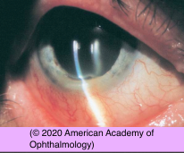
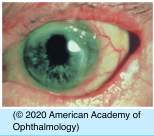
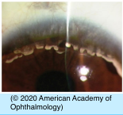

# Peripheral Ulcerative Keratitis (PUK) Differential Diagnosis

## Images

## Hierarchy

- Case Description
  - 40-year-old woman with unilateral eye pain, photophobia, and redness
  - Image Description
- PUK
  - systemic immune-mediated/ rheumatic diseases
    - rheumatoid arthritis
      - peripheral corneal thinning and vascularization
    - Wegener granulomatosis
    - systemic lupus erythematosus
    - polyarteritis nodosa
    - ulcerative colitis
    - relapsing polychondritis
    - rosacea
  - usually unilateral
  - 1 sector of cornea
  - within 2 mm of limbus
  - absent epithelium
    - pain
  - underlying stromal thinning
    - keratolysis
    - +- significant cellular infiltrate in the corneal stroma
  - vaso-occlusion of adjacent limbal vessels
  - adjacent conjunctiva can be minimally or severely inflamed
  - sclera is often involved
- Data acquistion
  - History
    - medical history
      - autoimmune (connective tissue) disease
        - joint pain
        - rheuamtoid arthritis
        - lupus
        - Wegener's
          - PUK
        - polyarteritis nodosa
        - inflammatory bowel disease
    - ocular history
      - onset & course of symptoms
        - PUK
          - Mooren’s ulcer
      - eye pain
        - rules out
          - Terrien marginal degeneration
          - pellucid marginal degeneration
          - furrow degeneration
      - contact lens wear
      - herpetic eye disease
      - history of ocular trauma/ surgery/parasitic diseases
        - Mooren ulcer
  - Physical Exam
    - facial/lid vesicles/scar
    - lagophthalmos
    - rosacea/blepharitis
    - corneal sensation
    - herpetic corneal scar
    - corneal epithelial defect
    - corneal thinning/ perforation
    - corneal infiltrate/scar
    - other signs of eye inflammation
      - anterior scleritis
      - anterior uveitis
      - hypopyon
      - vitritis
      - retinochoroiditis
      - PUK
      - nerve fiber layer infarcts
      - posterior scleritis
        - exudative RD
        - choroidal folds
- Mooren ulcer
  - clinical presentation
    - uni- or bilateral
    - chronic progressive
    - symptoms
      - pain
        - can be intense
      - tearing
      - photophobia
    - precipitating factors
      - trauma
      - surgery
      - exposure to parasitic infection
        - incidence of Mooren ulcer is particularly high in areas where parasitic infections are endemic
      - hepatitis C infection
    - ulceration of corneal stroma and epithelium
      - corneal periphery
        - starts in interpalpebral fissure
          - similar to Terrien
        - spreads circumferentially
        - then centripetally
          - leading undermined edge
          - slower ulceration toward sclera
            - does not involve sclera
              - in contrast to PUK
      - eye is inflamed
        - extensive vascularization and fibrosis
      - perforation
        - minor trauma
        - secondary infection
- Additional Testing
  - CBC, differential
  - ANA
  - ANCA
  - syphilis serology
  - ACE, lysozyme
  - PPD
  - CXR
  - UA
  - corneal smear/culture if infection
- Assessment
  - PUK
- in contrast to PUK & Mooren ulcer
- Treatment
  - Medical
    - antibiotic ointment
      - q2h
    - cycloplegia
    - systemic steroid
      - topical steroids usually not used in presence of significant corneal thinning
      - exclude TB, syphilis
    - steroid-sparing agents
      - to minimize steroid side effects
      - immunosuppressants
        - MTX
        - mycophenolate
        - azathioprine
        - cyclophosphamide
        - infliximab
    - oral doxycycline
      - metalloproteinase inhibition
    - ascorbic acid
      - collagen synthesis promoter
    - if corneal infiltrates
      - culture
      - empiric broad-spectrum topical antibiotics
  - Surgical
    - conjunctival excision/ recession
    - cyanoacrylate glue
    - corneal transplant
      - for (impending) perforation
  - Referrals/ Consultations
    - internal medicine consult
      - systemic work-up for autoimmune diseases associated with PUK
        - PUK may be the first sign of the underlying systemic disease!
- Terrien marginal degeneration
  - clinical presentation
    - unilateral or asymmetrically bilateral
    - second or third decade of life
    - painless
    - slowly progressive
    - thinning of the peripheral cornea
      - begins superiorly, spreads circumferentially
      - steep central wall
      - gradually sloping peripheral wall
    - fine vascular pannus
      - epithelium remains intact
    - line of lipid deposits at the leading edge of the pannus
    - spontaneous perforation is rare
      - can occur with minor trauma
    - against-the-rule astigmatism
  - in contrast to PUK & Mooren ulcer
- staphylococcal marginal keratitis
  - erythema/telangiectasia of lid margin
  - inferior cornea
- Patient Education
  - General
  - Dos
    - eye protection
      - glasses
      - eye shield at night
  - Complications
    - risk of eye perforation
    - risk of superinfection
  - Follow-up
    - examine daily for severe disease
      - continue treatment until epithelium heals
        - taper treatment
- dellen
  - neurotrophic keratopathy
    - bacterial or herpetic keratitis
      - exposure keratopathy
    - severe dry eye
- pellucid marginal degeneration
  - painless, bilateral asymmetric thinning of the inferior peripheral cornea
- furrow degeneration
  - clear zone between senile arcus and limbus
