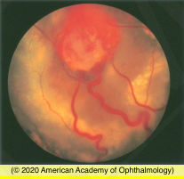
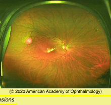
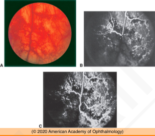
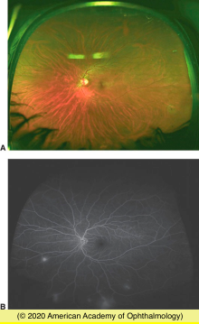

# Phakomatoses

## Images

## Hierarchy

- Introduction
  - group of disorders with common features of ocular and extraocular/systemic involvement of a congenital nature
  - most are hereditary
  - involve the neuroretina
    - exception Sturge-Weber syndrome
- Retinal Cavernous Hemangioma
  - 2 types
    - isolated
      - most cases
      - restricted to the retina or optic nerve head
        - autosomal-dominant
          - non-hereditary
    - as part of Wyburn-Mason syndrome
      - retina/optic nerve head hemangioma
      - skin hemangiomas
        - 1/2 patients
        - on the face
      - intracranial hemangiomas
        - seizures
        - mental changes
        - hemiparesis
        - papilledema
        - frequently a source of hemorrhage
  - usually asymptomatic
  - retinal findings
    - grapelike clusters of thin-walled saccular angiomatous lesions
      - unlike the vascular brain lesions of SWS
      - inner retina
      - optic nerve head
    - blood flow is derived from the retinal circulation
      - relatively stagnant
    - absence of subretinal fluid and exudate
    - fluorescein angiography
      - dilated saccular lesions fill slowly
      - plasma-erythrocyte layering
        - characteristic
      - no leakage
        - differentiates from retinal telangiectasia, retinal capillary hemangioblastomas, and racemose aneurysm of the retina
    - vitreous hemorrhage
      - rare
      - caused by vitreous traction
  - Treatment
    - usually not indicated
    - recurrent vitreous hemorrhage
      - photocoagulation
      - cryotherapy
      - vitrectomy
- Von Hippel–Lindau Disease
  - VHL gene mutation
    - short arm of chromosome 3
      - 3p26–p25
    - tumor suppressor gene
    - autosomal dominant
      - incomplete penetrance
      - variable expression
  - central nervous system tumors
    - hemangioblastomas of the cerebellum, medulla, pons, and spinal cord
    - 20%
  - retinal manifestations
    - spherical orange-red tumor
    - feeded by dilated, tortuous retinal artery
    - drained by an engorged vein
    - ± multiple in the same eye
    - ± bilateral
      - 50%
    - lipid exudates
    - exudative retinal detachment
      - cause decreased vision if macula involved
    - tractional detachment
    - vitreous hemorrhage
      - rare
    - may occur sporadically without systemic involvement
      - von Hippel lesions
    - optic nerve head/peripapillary hemangioblastomas
      - flat
      - difficult to recognize
  - Visceral manifestations
    - renal cell carcinoma
    - meningiomas
    - pheochromocytomas
    - cysts of the kidney, pancreas, liver, epididymis, and ovary
    - leading causes of death
      - cerebellar hemangioblastoma
      - renal cell carcinoma
  - Testing
    - wide-angle fluorescein angiography
      - allows detecting small, early lesions
    - genetic testing
    - diagnosis of a retinal hemangioblastoma warrants systemic workup ± genetic testing
  - management
    - treatment of all identified retinal angiomas
      - lesions usually enlarge with time
    - photocoagulation
    - photodynamic therapy
    - cryotherapy
      - larger lesions
      - can cause temporary and marked increase in the amount of exudation/exudative retinal detachment
    - successful treatment
      - shrinkage of angioma
      - attenuation of afferent vessels
      - resorption of subretinal fluid
    - careful follow-up
      - to detect recurrence
      - to detect new lesions
  - Vasoproliferative tumors
    - etiology
      - idiopathic
      - ROP
      - retinitis pigmentosa
    - the feeder artery and draining veins are not dilated
