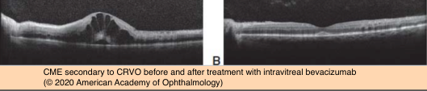

# Pharmocologic Management of Retinal Vein Occlusion

## Images

## Hierarchy

- Intravitreal corticosteroids
  - Risks
    - cataract
    - elevated IOP
      - 20-65%
  - SCORE study
    - indication
      - CME secondary to BRVO/CRVO
    - intravitreal triamcinolone vs standard care (macular grid laser)
      - comparable to macular grid laser with respect to ≥3 lines of visual acuity gain
    - CRVO arm
      - ≥15 ETDRS letter improvement at 1 year
        - 1 mg triamcinolone
          - 27%
        - 4 mg triamcinolone
          - 26%
        - observation
          - 7%
  - GENEVA study
    - indication
      - because of steroid complications the investigators concluded that macular grid laser remained the benchmark against which other treatments should be compared
      - CME secondary to BRVO/CRVO
    - intravitreal dexametasone implant (0.7 mg) vs sham
    - ≥15 ETDRS letter improvement between 30-90 days
      - greatest response at 60 days
    - at day 180 there was no significant difference between sham and treatment groups
  - COMRADE Study
    - indication
      - CME secondary to CRVO
    - dexamethasone 0.7 mg vs monthly ranibizumab
    - first 3 months
      - results were similar
    - at months 4-6
      - ranibizumab group had better visual acuity scores
    - ETDRS letters gained at month 6
      - 12.86 for ranibizumab
      - 2.96 for dexamethasone implant
- Intravitreal anti-VEGF therapy
  - BRAVO study
    - indication
      - CME secondary to BRVO
    - monthly ranibizumab (0.3 mg or 0.5 mg) vs sham
    - at 6 months
      - gain of ≥15 ETDRS letters
        - 61.1%
          - ranibizumab (0.3 mg)
        - 55.2%
          - ranibizumab (0.5 mg)
        - 28.8%
          - sham
  - CRUISE study
    - indication
      - CME secondary to CRVO
    - monthly ranibizumab (0.3 mg or 0.5 mg) vs sham
    - at 6 months
      - ≥15 ETDRS letters
        - 47.7%
          - ranibizumab (0.3 mg)
        - 46.2%
          - ranibizumab (0.5 mg)
        - 16.9%
          - sham
  - VIBRANT study
    - intravitreal aflibercept for CME secondary to BRVO
  - COPERNICUS study
    - intravitreal aflibercept for CME secondary to CRVO
      - benefits were maintained during the second 6 months of these studies (as needed treatment)
  - GALILEO study
    - intravitreal aflibercept for CME secondary to CRVO
  - SCORE2 study
    - indication
      - CME secondary to CRVO
    - bevacizumab noninferior to aflibercept
  - CRAVE study
    - indication
      - CME secondary to BRVO and CRVO
    - monthly bevacizumab vs ranibizumab for CME secondary to BRVO/ CRVO
    - no significant differences in central foveal thickness reduction or visual acuity improvement
