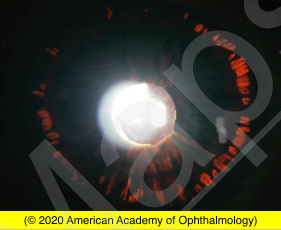
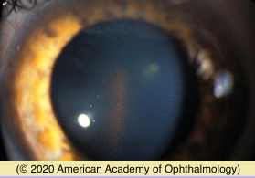
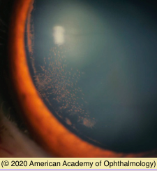
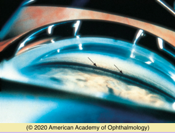

# Pigment Dispersion Syndrome

## Images

## Hierarchy

- Case Description
  - young myopic man with no ocular complaints
  - Image Description
    - mid-peripheral iris transillumination defects (in both eyes)
- Differential Diagnosis
  - pigment dispersion syndrome/glaucoma
  - trauma/surgery
    - iris chafe with sulcus IOL
    - accidental or surgical trauma to iris
    - siderosis
  - HSV/VZV uveitis
  - PXF
    - iris TIDs are near the pupillary margin
  - albinism
    - Waardenburg syndrome
      - • Partial albinism
      - • White forelock
      - • Deafness
      - • Dystopia canthorum
      - • Iris hypochromia
        - pale blue eyes
        - heterochromia irides
  - radiation
- Additional Testing
  - visual field exam
- Assessment
  - PDS/PDG
- Treatment
  - Medical
    - argon laser trabeculoplasty
    - selective laser trabeculoplasty
      - greater risk of post-laser IOP spikes
        - lower energy should be used
        - only 180 degrees of treatment is advised initially
    - IOP lowering medication
    - miotic agents
      - reduce iris-zonule contact
      - cause fluctuating myopia
  - Surgical
    - laser PI
      - for early disease
        - controversial
    - guarded filtering surgery
    - tube shunt
      - higher risk of hypotony
        - avoid early overinfiltration
- Patient Education
  - General
    - explain pathophysiology
  - Course
    - with age, the signs and symptoms of pigment dispersion may decrease
  - Complications
    - PDG
      - risk of glaucoma is ≈25%–50%
    - RD
      - myopia
        - review RD symptoms
  - Follow-up
    - as a glaucoma suspect
      - IOP
      - optic nerve appearance
      - VF
- Data acquistion
  - History
    - refractive error
      - blurred vision, halos, eye pain after exercise or pupil dilation
      - myopia
    - trauma/surgery
    - herpes infection
  - Physical Exam
    - IOP
    - slit lamp
      - Krukenberg spindle
      - pigment on lens capsule
      - pigment on lens zonules
      - PXF material
    - gonioscopy
      - TM pigmentation
    - funduscopy
      - glaucomatous optic nerve damage
      - lattice degeneration
      - retinal detachment
    - examine other eye
