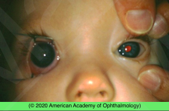
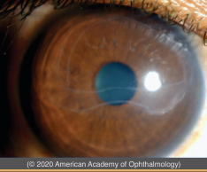

# Primary Congenital Glaucoma

## Images

## Hierarchy

- Case Description
  - 2-month-old boy with right eye tearing, frequent blinking, and forceful closure of his eyelids
  - Image Description
    - enlarged cornea of the right eye
- Data acquisition
  - History
    - onset/course
    - epiphora
    - photophobia
    - blepharospasm
    - discharge
    - forceps delivery
    - maternal infections during pregnancy
    - family hx
      - congenital glaucoma
      - CHED/CHSD
      - congenital megalocornea
      - metabolic diseases
  - Physical Exam
    - vision
    - APD
    - external exam
      - port wine stains
        - Sturge-Weber syndrome
      - forceps mark
      - dacryocystocele, discharge from lacrimal puncta
    - IOP
    - anterior segment
      - corneal diameter >12 mm
      - increased tear lake
      - corneal edema
      - horizontal Descemet tears
      - corneal thickness (pachymetry)
      - AC reaction
        - anterior uveitis
    - gonioscopy
      - abnormal angle anatomy
    - dilated funduscopy
      - optic disc cupping
        - Sturge-Weber syndrome
          - congenital rubella
      - diffuse choroidal hemangioma
      - salt & pepper retinopathy
    - cycloplegic refraction
      - myopic shift
      - normal = 17 mm at birth
  - may need to be done under general anesthesia
- Differential Diagnosis
  - primary congenital glaucoma
    - 80% bilateral
    - 10-40% familial
      - AR
    - classic triad
      - epiphora
      - photophobia
      - blepharospasm
    - corneal edema
  - forceps injury
    - vertical/oblique descemet tears
    - unilateral
  - NLD obstruction
  - CHED
    - bilateral
    - CHED1
      - AD
      - presents during 1st-2nd year of life
      - progresses over 1–10 years
    - CHED2
      - AR
      - congenital
      - stationary
  - CHSD
    - congenital stromal corneal dystrophy (CSCD)
    - AD
  - congenital megalocornea
    - bilateral
      - boys
    - XLR
    - .>14 mm
  - anterior uveitis
  - corneal abrasion/foreign body
  - congenital rubella
    - microphthalmia
    - corneal clouding
    - cataract
    - glaucoma
    - salt & pepper retinopathy
      - most common ocular manifestation
        - 25%–50%
    - hearing loss
    - cardiac defects
  - Sturge-Weber syndrome
  - STUMPPeD
    - sclerocornea
    - trauma/tear
    - ulcer
    - metabolic
      - bilateral
      - mucopolysaccharidoses
      - cystinosis
    - Peters
    - PPMD
      - at birth
      - bilateral
      - grouped vesicles, scalloped bands
    - dermoid (limbal)
- Additional Testing
  - A-scan for axial length
- Assessment
  - congenital glaucoma
- Treatment
  - Medical
    - to lower IOP before surgery
    - adjunct treatment after surgery
    - avoid brimonidine
      - relative contraindication <2 years of age
  - Surgical
    - treatment of choice for primary congenital glaucoma
    - goniotomy
      - if clear cornea
    - trabeculotomy
      - cloudy cornea
      - 2 failed goniotomies
      - age>1.5 yr
    - trabeculectomy with mitomycin C
    - tube shunt
    - cyclodestructive procedures
  - Referrals
    - +- genetic counseling
- Patient Education
  - Inform patient’s family about
    - pathogenesis & natural history
    - treatment options
    - prognosis
      - guarded
        - but useful vision can be maintained with timely treatment
    - complications
      - amblyopia
        - prognosis best for patients whose glaucoma is diagnosed between 3 and 12 months
          - vast majority respond to angle surgery
      - myopia
      - corneal scarring
      - glaucomatous optic atrophy
    - follow-up
      - life-long treatment (medical/ surgical) may be necessary
