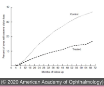
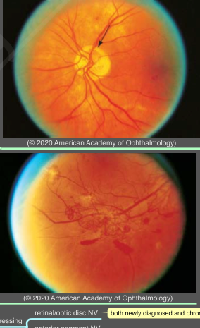
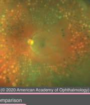

# Proliferative Diabetic Retinopathy

## Images

## Hierarchy

- Definition
  - extraretinal fibrovascular proliferation
- 3 stages
  - fine new vessels extend beyond ILM
    - use the posterior hyaloid as a scaffold
  - new vessels increase in size & extent and develop a fibrous component
  - new vessels regress leaving residual fibrovascular tissue
- Laser surgery
  - for eyes with high-risk PDR not already receiving anti-VEGF therapy, PRP is almost always recommended
  - some clinicians combine anti-VEGF therapy with PRP
    - initial anti-VEGF therapy will regress NV quickly
    - effect of PRP will endure over subsequent years
  - Mechanism of action
    - PRP destroys ischemic retina thus reducing intraocular VEGF
    - PRP increases intraocular oxygen tension
      - (1) decreasing oxygen consumption as a result of purposeful retinal destruction
      - (2) increasing diffusion of oxygen from the choroid
  - Diabetic Retinopathy Study (DRS)
    - 1 eye randomly assigned to photocoagulation and 1 eye assigned to no photocoagulation
    - at 5 years of follow-up, eyes treated with PRP had a reduction of ≥ 50% in SVL compared with untreated control eyes
      - treated eyes with high-risk PDR achieved the greatest benefit
    - complications of PRP
      - decrease in visual acuity by ≥1 lines
        - 11%
      - visual field loss
        - 5%
          - DRCR.net found no long-term vision benefit of multiple-session over single- session laser administration
  - PRP technique
    - single session or over multiple sessions
    - additional therapy can be applied incrementally in an attempt to achieve complete regression of NV
    - full PRP
      - argon green or blue-green laser
      - ≥1200 burns
      - separated by 1/2 burn width
    - automated pattern scan laser systems
      - not equivalent in their treatment effect on a burn-for-burn comparison
      - burn-count target for equivalent treatment effect may need to be higher
  - Adverse effects of scatter PRP
    - transient loss of 1 or 2 lines of visual acuity
    - photopsias
    - decreased
      - night vision
      - color vision
      - peripheral vision
      - contrast sensitivity
      - accommodation
      - pupillary dilation
        - sparing the horizontal meridians (path of the long ciliary vessels and nerves) protects against these adverse effects
      - corneal sensitivity
    - choroidal detachment
    - increased glare
    - precipitatation or worsening of macular edema
- High-risk PDR
  - any NVD with vitreous or preretinal hemorrhage
  - extent of NVD ≥ 1/4 disc area, ± vitreous or preretinal hemorrhage
  - extent of NVE ≥ 1/2 disc area + vitreous or preretinal hemorrhage
- Nonsurgical management
  - Intravitreal anti-VEGF
    - highly effective at regressing
      - retinal/optic disc NV
        - both newly diagnosed and chronic, refractory cases
      - anterior segment NV
    - reasonable first-line alternative to PRP
      - patients should be able to adhere to monthly follow-up visits throughout first 1–2 years of treatment
      - for non-adherent patients, PRP is the most appropriate option
    - preoperative intravitreal anti-VEGF is a helpful adjunct to vitrectomy
    - potential complications
      - tractional RD
      - retinal tears
      - combined tractional and rhegmatogenous RD
    - DRCR.net Protocol S study
      - randomized eyes with active PDR to either prompt PRP or intravitreal ranibizumab and deferred PRP
      - at 2 years, visual outcomes were equivalent
      - ranibizumab treatment was associated with multiple benefits
        - better average vision over the 2 years
        - less peripheral visual field loss
        - reduced rates of vitrectomy
        - fewer cases of DME
      - ranibizumab was well tolerated
      - no substantial differences in rates of major cardiovascular adverse events
  - intravitreal steroid agents
    - reduce rates of
      - vitreous hemorrhage
      - need for PRP
      - development of neovascularization
- Management of neovascularization of the iris
  - small, isolated tufts of NV at pupillary border are relatively common
    - treatment can be withheld for these tufts in favor of careful monitoring
  - indications for treatment
    - contiguous neovascularization of the pupil and iris collarette
      - ± inclusion of anterior chamber angle
    - wide-field FA reveals widespread nonperfusion or peripheral neovascularization
  - treatment
    - PRP
    - intravitreal injection of anti-VEGF drugs can be used as a temporizing measure
- Vitrectomy surgery
  - indications
    - nonclearing vitreous hemorrhage
    - significant recurring vitreous hemorrhage, despite use of maximal PRP
    - dense premacular subhyaloid hemorrhage
    - tractional retinal detachment involving or threatening the macula
    - combined tractional and rhegmatogenous retinal detachment
    - red blood cell–induced (erythroclastic) glaucoma and “ghost cell” glaucoma
    - anterior segment neovascularization with media opacities preventing PRP
  - Vitreous hemorrhage
    - Diabetic Retinopathy Vitrectomy Study (DRVS)
      - compared early (1–6 months after onset of vitreous hemorrhage) versus late (1 year after onset) vitrectomy
      - early vitrectomy beneficial for type 1 DM with severe vitreous hemorrhage
      - early vitrectomy not beneficial for type 2 DM or mixed DM with severe vitreous hemorrhage
    - if PRP has not been performed previously, earlier intervention is usually recommended
    - frequent echography to monitor for RD
      - if RD is discovered, the timing for vitrectomy depends upon characteristics of RD
    - patients with bilateral severe vitreous hemorrhage should undergo vitrectomy in 1 eye as soon as possible
  - Tractional retinal detachment
    - partial PVD frequently develops in eyes with fibrovascular proliferation, resulting in traction on retina and new vessels
    - tractional complications
      - macular heterotopia
      - tractional RD
      - combined tractional and rhegmatogenous RD
      - retinal schisis
      - vitreous hemorrhage
    - chronic RD increases risk of anterior segment NV
    - tractional RD not involving the macula may remain stable for many years
    - tractional RD involving or threatening the macula requires prompt vitrectomy
    - combined tractional and rhegmatogenous RD may progress rapidly
      - consider urgent surgery
