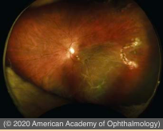

# Prophylactic Treatment of Retinal Breaks

## Images

## Hierarchy

- Introduction
  - vast majority of retinal breaks do not cause RD
  - Goal of prophylactic treatment
    - creation of a chorioretinal adhesion around each break to prevent fluid from entering the subretinal space
    - treatment does not eliminate risk of new tears or RD
  - If subretinal fluid is present, treatment should surround the area of subretinal fluid
  - if insufficient treatment is applied, vitreous traction can lead to anterior extension of horseshoe tears and RD
  - when treating lattice degeneration, the entire lesion needs to be surrounded
  - Factors to consider
    - symptoms
    - family history
    - residual traction
    - size and location of the break
    - phakic status
    - refractive error
    - status of the fellow eye
    - presence of subretinal fluid
    - availability of the patient for follow-up evaluation
  - Prophylaxis is sometimes contraindicated in
    - .> 6.00 diopters (D) of myopia
    - .> 6 clock-hours of lattice degeneration
- Lattice Degeneration
  - 11-year follow-up study of patients with untreated lattice degeneration
    - RD occurred in ≈ 1%
  - presence of lattice, with or without atrophic holes, generally does not require prophylaxis in the absence of other risk factors or symptoms
  - consider treatment if
    - retinal detachment in the fellow eye
    - flap tears
    - pseudophakia
    - aphakia
- Aphakia and Pseudophakia
  - higher risks of RD (1%–3%)
    - should be warned of potential symptoms and carefully examined if symptoms occur
  - population-based 25-year follow-up study
    - probability ratio of RD following cataract surgery
      - 11x in the first year
      - 4x in years 5-20
    - cumulative risk of RD after cataract surgery
      - 1.79% at 20 years
  - risk factors for RD following cataract surgery
    - male sex
    - younger age
    - myopia
    - increased axial length
    - posterior capsular tear
    - absence of PVD
- Fellow Eye in Patients With Retinal Detachment
  - fellow-eye risk of RD
    - ≈10% for phakic RD
    - 20%–36% for aphakic or pseudophakic RD
  - prophylactic treatment of flap tears and lattice degeneration is often recommended
- Symptomatic Retinal Breaks
  - 7–18% of eyes with symptomatic PVD have ≥ 1 tractional tear
  - acute symptomatic breaks are at greater risk of progressing to RD
    - especially if there is associated vitreous hemorrhage
  - acute symptomatic flap tears
    - commonly treated prophylactically
  - acute operculated holes
    - less likely to cause detachment
    - usually not treated
    - indications for treatment
      - there is vitreous hemorrhage
      - hole is large
      - hole is located superiorly
      - slit-lamp biomicroscopy reveals persistent vitreous traction at margin of operculated hole
  - Atrophic holes
    - generally treatment is not recommended
- Subclinical Retinal Detachment
  - definition
    - asymptomatic retinal detachment
    - subretinal fluid extends > 1 disc diameter from the break but not more than 2 disc diameters posterior to the equator
  - ≈ 30% of subclinical RDs progress
    - treatment is often recommended
      - especially if
        - symptomatic
        - traction on the break
    - demarcation line suggests lower risk
      - progression may occur through the demarcation line
- Asymptomatic Retinal Breaks
  - asymptomatic flap tears
    - ≈ 5% progress to RD
    - treatment is not universally recommended in emmetropic, phakic eyes
    - consider treatment if
      - lattice degeneration
      - myopia
      - subclinical detachment
      - aphakia
      - pseudophakia
      - history of retinal detachment in the fellow eye
  - asymptomatic operculated holes and atrophic holes
    - treatment is not generally recommended
