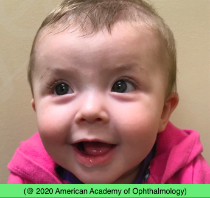

# Pseudoesotropia

## Images

## Hierarchy

- Case Description
  - infant girl is brought because parents are concerned that her eyes are turned in
- Data acquisition
  - History
    - onset & course
      - review old pictures
    - constant vs intermittent
      - variation
        - during the day
        - with near work
        - with prolonged work
    - family history of strabismus/amblyopia
  - Physical Exam
    - cover-uncover test
    - alternate cover test
    - Hirschberg test
    - VA
      - preferential-looking
        - Teller cards
      - asymmetric objection to occlusion of either eye
    - cycloplegic refraction
    - dilated anterior segment & fundus exam
- Image Description
- Assessment
  - pseudoesotropia
- Treatment
  - Medical
    - reassure parents
- Differential Diagnosis
  - pseudoesotropia
    - etiology
      - flat, broad nasal bridge
        - The infant has broad epicanthal folds and is looking to the right; the corneal light reflexes are symmetrical
      - prominent epicanthal folds
      - narrow interpupillary distance
      - negative angle kappa
        - corneal light reflection will be temporal to center of cornea
  - esotropia
- Patient Education
  - Prognosis & Complications
    - may improve with growth of face and nasal bridge
  - Follow-up
    - monitor for true strabismus
  - Dos
    - ask parents to report any change in pattern of apparent eye deviation
- Angle kappa
  - ET
    - negative
      - eXPENsive
  - XT
    - positive
