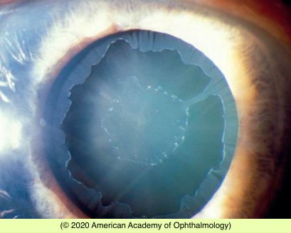

# Pseudoexfoliation Syndrome (PXF)

## Images

## Hierarchy

- Case Description
  - middle-aged woman comes for routine eye examination
  - Image Description
    - deposition of white fibrillar material in a concentric “bull’s-eye” pattern on the anterior lens capsule
- Additional Testing
  - VFs
- Assessment
  - PXF syndrome
- Differential Diagnosis
  - PXF syndrome
    - bilateral asymmetric
    - multifactorial
      - LOXL1 mutation
      - UV light exposure
    - family history of glaucoma
  - true exfoliation
  - amyloid
    - over lens capsule
    - at pupillary margin
  - uveitis
    - photophobia
    - KP
    - PAS/PS
    - fluctuating IOP
  - pigment dispersion syndrome (PDS)
    - myopia
      - retinal detachment
    - deep AC
    - midperipheral TIDs
  - UGH syndrome
    - prior surgery
- Treatment
  - Medical
    - glaucoma eye drops
  - Surgical
    - SLT
    - ALT
      - response is short-lived
    - filtering surgery
- Patient Education
  - Prognosis & Complications
    - 6x higher risk of glaucoma
      - wide IOP fluctuations
        - PXF glaucoma has worse prognosis than POAG
      - can progress rapidly
    - cataract surgery is risky
      - poor dilation
      - weak zonules
        - zonular dehiscence
          - phacodonesis
          - lens subluxation
        - vitreous loss
      - retained lens material
  - Follow-up
    - glaucoma monitoring
      - no glaucoma
        - q 6-12 mo
      - glaucoma
        - q 1-3 months
- Data acquistion
  - History
    - European (Scandinavian) origin
    - occupation
      - exposure to heat
        - glass blower
        - welder
          - true exfoliation
    - family history of glaucoma
  - Physical Exam
    - IOP
      - unstable
    - slit lamp
      - fibrillary/flaky material
        - endothelium
        - anterior lens capsule
          - dilate pupil
      - zonular laxity
        - phacodonesis
        - iridodonesis
      - K spindle
      - AC cells
        - uveitis
      - TIDs
        - peripupillary
          - PXF
        - mid-peripheral
          - PDS
      - degree of pupil dilation
        - poor pupil dilation in eyes with PXF
      - gonioscopy
        - TM pigmentation
          - Sampolesi line
            - PXF
            - PDS
    - funduscopy
      - optic disc cupping
