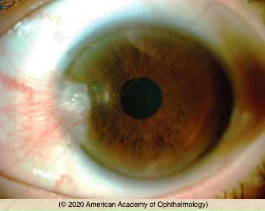

# Pterygium

## Images

## Hierarchy

- Case Description
  - 45-year-old sailor has noted a slowly enlarging pinkish spot on the surface of his left eye
  - Image Description
    - wing-shaped growth of conjunctiva and fibrovascular tissue on the superficial cornea; no leukoplakia
- Data acquisition
  - History
    - onset & progression
    - symptoms
      - redness
      - irritation/foreign-body sensation
      - poor cosmetic appearance
      - contact lens intolerance
    - sunlight exposure
    - sunglass wear
    - prior eye trauma/surgery
    - prior eye diseases
  - Physical Exam
    - slit lamp exam
      - corneal thinning
        - pseudopterygium
      - anterior edge vs whole lesion adherent to cornea
        - pseudopterygium vs pterygium
      - leukoplakia
      - gelatinous appearance
        - OSSN
      - location not at 3 & 9
    - refraction for corneal astigmatism
- Assessment
  - pterygium
- Treatment
  - Medical
    - eye protection from
      - sun
      - dust
      - wind
        - UV-blocking sunglasses
    - eye lubrication
    - dellen
      - artificial tear ointment q2h
    - inflamed pterygium
      - mild topical steroid
      - topical NSAID
      - topical antihistamine
  - Surgical
    - indications for excision
      - threatens visual axis
      - significant astigmatism
      - excessive irritation
      - interferes with contact lens wear
      - prior to cataract or refractive surgery
      - poor cosmesis
      - atypical appearance
      - fast growth
    - conjunctival autograft transplantation
    - amniotic membrane graft
    - ± MMC
      - for recurrent pterygia
- Differential Diagnosis
  - pterygium
    - sunlight exposure
    - equatorial regions
    - 3 & 9 o'clock positions
  - pseudopterygium
    - conjunctival scarring
      - trauma/surgery
      - chemical burn
      - corneal ulcer
    - pannus from
      - contact lens wear
      - blepharitis, rosacea
      - SLK
      - herpes
      - molluscum contagiosum
      - trachoma
      - atopy/vernal keratoconjunctivitis
  - sclerokeratitis
  - tumors
    - ocular surface squamous neoplasia (OSSN)
    - limbal dermoid
      - congenital
      - inferotemporal limbus
      - ± Goldenhar syndrome
    - other conjunctival tumors
      - papilloma
      - melanoma
- Patient Education
  - Prognosis
    - can recur after surgery
  - Complications
    - interference with contact lens wear
    - involvement of visual axis
    - astigmatism
  - Follow-up
    - asymptomatic
      - q1 year
      - measure rate of progression
    - topical steroid
      - check in a few weeks for improvement and to monitor IOP
