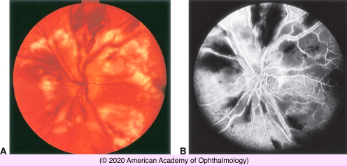
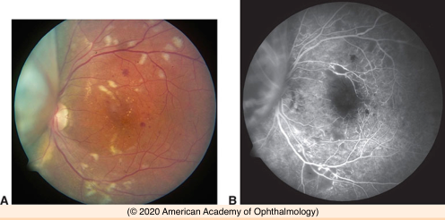

# Radiation Retinopathy

## Images

## Hierarchy

- Radiation Retinopathy
  - Pathogenesis & Course
    - ionizing radiation causes retinal microangiopathy
      - resembles diabetic retinopathy
    - delayed onset
      - within months to years after radiation treatment
        - external-beam radiation
          - ≈ 18 months
        - earlier with brachytherapy
      - slowly progressive
    - determining factors
      - total dose
        - usually >30–35 grays (Gy)
          - even 15 Gy of external-beam radiation can cause retinopathy
        - 60 Gy
          - 50%
        - 70–80 Gy
          - 85%–95%
      - volume of retina irradiated
      - fractionation scheme
  - Symptoms
    - asymptomatic
    - decreased visual acuity
  - Clinical Findings
    - capillary telangiectasis
    - microaneurysms
    - retinal hemorrhages
    - cotton-wool spots
    - perivascular sheathing
    - central retinal vein occlusion
    - central retinal artery occlusion
      - choroidal neovascularization
    - macular edema
    - capillary nonperfusion
      - on fluorescein angiography
    - neovascularization of the retina, iris, or disc
      - vitreous hemorrhage
      - neovascular glaucoma
      - tractional retinal detachment
    - acute optic neuropathy
      - disc edema & congestion
      - optic atrophy
  - Visual outcome
    - extent of macular involvement
      - cystoid macular edema
      - exudative maculopathy
      - capillary nonperfusion
  - Treatment
    - intravitreal
      - triamcinolone acetonide
      - anti-VEGF drugs
    - focal laser therapy
      - macular edema
    - panretinal photocoagulation
      - ischemia and neovascularization
- Purtscher Retinopathy and Purtscherlike Retinopathy
  - Pathogenesis
    - acute compression injuries to the thorax or head
    - injury-induced complement activation
      - granulocyte aggregation
        - leukoembolization
          - occlusion of small arterioles
  - Clinical findings
    - 1 or both eyes
    - large cotton-wool spots
      - surrounding the optic disc
    - hemorrhages
    - ± disc edema
      - ± optic atrophy
        - permanent vision loss
        - afferent pupillary defect
  - fluorescein angiography
    - arteriolar obstruction and leakage
  - Purtscherlike retinopathy
    - other conditions may activate complement and produce a similar fundus appearance
      - amniotic fluid embolism
      - retrobulbar anesthesia
- acute pancreatitis
  - chronic renal failure
    - collagen-vascular diseases
- childbirth
  - amniotic fluid embolism
- fat embolism
  - orbital steroid injection
  - etiology
    - crushing injuries
    - long-bone fractures
  - intraretinal hemorrhages
    - paramacular area
  - cotton-wool spots
    - smaller and more peripheral than Purtscher retinopathy
- Terson Syndrome
  - abrupt intracranial hemorrhage
    - acute rise in the intraocular venous pressure
      - rupture of peripapillary and retinal vessels
    - 1/3 of patients with subarachnoid or subdural hemorrhage have associated intraocular hemorrhage
  - any age
    - most common between 30-50 years
  - hemorrhage
    - subretinal
    - intraretinal
    - sub-ILM
    - vitreous
  - spontaneous improvement
    - visual function is unaffected once the hemorrhage clears
  - vitrectomy for vitreous hemorrhage
- Valsalva Retinopathy
  - treatment is similar to diabetic retinopathy
  - sudden rise in intrathoracic or intra-abdominal pressure
    - coughing
    - vomiting
    - lifting
    - straining for a bowel movement
  - rupture small superficial capillaries in the macula
  - Clinical
    - hemorrhage
      - under the ILM
        - hemorrhagic detachment of the ILM
      - subretinal hemorrhage
      - Vitreous hemorrhage
    - vision is usually only mildly reduced
    - spontaneous resolution
      - within months
      - prognosis is excellent
  - differential diagnosis
    - posterior vitreous separation
      - a peripheral retinal tear must be ruled out
    - macroaneurysm
      - an aneurysm along an arteriole must be ruled out
