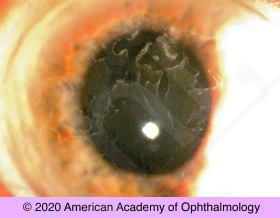

# Recurrent Corneal Erosion

## Images

## Hierarchy

- Case Description
  - 40-year-old woman complains of recurrent episodes of eye pain, foreign body sensation, and tearing upon opening her eyes in the morning
  - Image Description
- Assessment
  - recurrent corneal erosion secondary to epithelial basement membrane dystrophy
- Treatment
  - Medical
    - acute
      - artificial tear drops
        - artificial tear ointment at bedtime
      - for larger defects
        - antibiotic ointment
        - cycloplegic eyedrop
        - pressure patch
        - bandage contact lens
          - until epithelium heals
    - chronic
      - sodium-chloride drops
        - sodium-chloride ointment at bedtime
      - low-dose oral doxycycline
      - short-term topical steroid
      - treat x 3-6 months
  - Surgical
    - traumatic cases outside visual axis
      - anterior stromal puncture
        - bent 30-g needle
        - Nd:YAG laser
    - large abnormal areas in visual axis
      - epithelial debridement
        - cellulose sponge or diamond burr
      - PTK
        - hyperopic shift
- Differential Diagnosis
  - anterior corneal dystrophy
    - epithelial basement membrane dystrophy (MDF corneal dystrophy)
      - anterior segment photography using sclerotic scatter demonstrates characteristic geographic maps
    - others
      - Meesman
        - subepithelial dystrophy
      - Reis-Bucklers
        - Bowman membrane dystrophyies
      - Thiel-Behnke
  - stromal corneal dystrophy
    - lattice
    - granular
    - macular
  - trauma/surgery
    - may have happened years before
  - diabetes
  - corneal degeneration
    - band keratopathy
    - Salzmann nodular degeneration
- Patient Education
  - General
    - explain pathophysiology
  - Prognosis
    - good
  - Course
    - complete healing may take a few months
    - may recur
  - Follow-up
    - q 1-2 days until epithelium heals
      - use ointment for 3-6 mo after healing
    - then 1-3 months
- Data acquistion
  - History
    - medical history
      - diabetes
    - ocular history
      - previous similar episodes
      - eye trauma/surgery or corneal abrasion
    - family history
      - family history of corneal dystrophy
  - Physical Exam
    - slit lamp examination
      - signs of corneal dystrophy
        - examine both eyes
      - corneal fluorescein staining
        - abrasion
          - negative or positive abrasion
        - heaped up epithelium
  - Additional Testing
