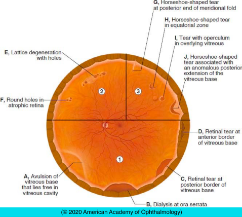

# Retinal Breaks

## Images

## Hierarchy

- Introduction
  - definition
    - full-thickness defect in the neurosensory retina
  - allows liquid from vitreous cavity to enter the potential space between sensory retina and RPE
    - rhegmatogenous retinal detachment
- Traumatic Breaks
  - penetrating trauma
    - direct retinal perforation
    - late fibrocellular proliferation
      - tractional RD
  - blunt trauma
    - Mechanism
      - coup
        - adjacent to the point of trauma
      - contrecoup
        - opposite the point of trauma
        - rapid compression of eye along its anteroposterior axis
          - rapid expansion in the equatorial plane
            - severe traction on the vitreous base
    - Clinical Features
      - types of break
        - large, ragged equatorial breaks
        - dialysis
          - most common
          - usually at posterior border of vitreous base but can also occur at anterior border
          - ± avulsion of the vitreous base
            - can be avulsed from underlying retina and nonpigmented epithelium of pars plana without tearing either one
            - generally one or both are also torn in the process
        - macular hole
          - pathognomonic of ocular contusion
        - horseshoe-shaped tears
          - at posterior margin of the vitreous base
          - at posterior end of a meridional fold
          - at equator
        - operculated holes
      - often multiple
      - commonly in inferotemporal and superonasal quadrants
- Types
  - flap/horseshoe tears
    - strip of retina is pulled anteriorly by vitreoretinal traction
    - a result of posterior vitreous detachment or trauma
    - symptoms
      - floaters
      - photopsias
  - giant retinal tears
    - extends ≥90° (3 clock-hours) circumferentially
    - along the posterior edge of the vitreous base
  - operculated holes
    - traction tears a piece of retina completely free
  - retinal dialyses
    - after blunt trauma
      - circumferential, linear break at ora serrata, with vitreous base attached to retina posterior to tear’s edge
  - atrophic retinal holes
    - atrophy of inner retinal layers
    - not associated with vitreoretinal traction
    - not linked to increased risk of retinal detachment
- Trauma in Young Eyes
  - vitreous has not yet undergone syneresis/liquefaction
    - does not allow fluid movement through retinal tears or dialyses
  - retinal detachment is usually delayed
    - immediate
      - 12%
    - < 1month
      - 30%
    - < 8 months
      - 50%
    - < 24 months
      - 80%
  - Clinical Features
    - shallow RD
    - signs of chronicity
      - multiple demarcation lines
      - subretinal deposits
      - intraretinal schisis
  - if PVD present or develops later after trauma
    - retinal breaks resemble nontraumatic breaks
    - RD may be acute
