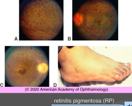

# Retinal Degeneration With Systemic Involvement I

## Images

## Hierarchy

- Pigmentary retinopathy
  - panretinal disturbance of retina and RPE
  - pigmentary alterations
    - pigment deposits
      - spicules
      - clumps
    - RPE depigmentation (atrophy)
- Bardet-Biedl syndrome
  - genetics
    - inheritance pattern
      - multigenic
      - autosomal recessive
    - affected proteins mediate and regulate microtubule-based intracellular transport processes
  - a number of different diseases with similar constellation of findings
    - pigmentary retinopathy
      - severe rod-cone dystrophy
        - usually sine-pigmento
        - usually without bone-spicule pigment clumping
      - bull's eye atrophic maculopathy
    - obesity
    - polydactyly
      - look for scars from previous surgeries
    - hypogonadism
    - cognitive disability
    - urethral reflux
      - pyelonephritis
- Leber congenital amaurosis (LCA)
  - Clinical
    - severely reduced vision from birth
      - 20/200 to NLP
    - severely diminished or extinguished ERG signal present at birth
    - wandering nystagmus
    - some infants rub or poke their eyes (oculodigital reflex)
      - If ERG changes are progressive, evaluation should include careful screening for congenital syndromes
    - in early stages, obvious fundus changes are rare
    - central macular atrophic lesions
    - early-onset cataracts
      - older children
    - keratoconus
    - normal intelligence
      - ± psychomotor impairment secondary to sensory deprivation
  - Genetics
    - 3 autosomal dominant
    - 18 autosomal recessive
      - RPE65 mutation
    - some forms of LCA involve developmental defects, while others represent degenerations of normally formed retina
  - Types
    - nonsyndromic
    - syndromic
      - seizures
      - clear deterioration of neurologic/mental status
        - decline in school performance
      - molecular genetic diagnosis can identify potential systemic syndromes that warrant medical management
    - postinfectious etiologies should be considered based on clinical history and clinical findings
  - Diagnostic testing
    - ERG
      - minimal or undetectable response
    - OCT
    - molecular genetic testing
      - best method for distinguishing stationary and progressive hereditary retinopathies
        - ERG cannot determine if the condition is stationary (congenital stationary night blindness [CSNB] or achromatopsia) or progressive (rod–cone dystrophy or cone–rod dystrophy)
  - gene therapy
    - Luxturna
      - RPE65 mutation-associated LCA
      - aged 1 year or older
      - adeno-associated virus vector
- Usher syndrome
  - definition
    - retinitis pigmentosa (RP)
    - congenital sensorineural hearing loss
  - demographics
    - prevalence
      - 3/100,000
    - 10% of RP patients have profound deafness
    - 6% of children in deaf schools
  - Types
    - type 1
      - early & profound deafness
      - RP
        - starts in childhood (by age 10 years)
      - vestibular areflexia
    - type 2
      - moderate to severe hearing loss
      - RP
        - starts in the second decade
      - normal vestibular function
    - type 3
      - progressive hearing loss
      - variable RP
      - sporadic vestibular function
  - genetics
    - autosomal recessive
    - 16 known genes
      - encode proteins present in cilia of inner ear and in cone outer segments
  - differential diagnosis of pigmentary retinopathy + hearing loss
    - Alport syndrome
    - Alstrom syndrome
    - Cockayne syndrome
    - spondyloepiphyseal dysplasia congenita
    - Hurler syndrome
    - Refsum disease
    - congenital rubella
