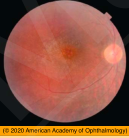
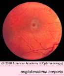
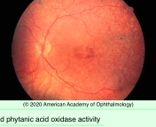
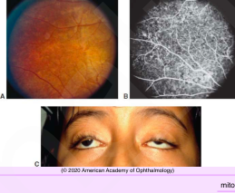
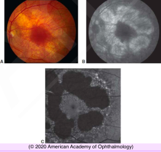

# Retinal Degeneration With Systemic Involvement IV: Central Nervous System Peroxisomal disorders

## Images

## Hierarchy

- Neuronal ceroid lipofuscinoses (NCLs)/Batten disease
  - Introduction
    - autosomal recessive
    - accumulation of waxy lipopigments
      - within lysosomes of neurons and other cells
    - usually evident in early childhood
    - belong to a larger group of diseases known as lysosomal storage disorders
  - Clinical
    - Systemic
      - progressive dementia
        - differentiate from primary Leber congenital amaurosis
      - seizures
    - Ocular
      - ocular findings are seen in infantile & juvenile types of NCL
      - loss of vision
      - pigmentary retinopathy
        - macular pigmentary changes
          - bull’s-eye atrophic maculopathy
            - 2 adult forms of NCL do not have ocular manifestations
        - mottling of the fundus periphery
      - retinal vascular attenuation
      - optic atrophy
      - reduced or absent ERG signals
  - Diagnosis
    - genetic testing
    - peripheral blood smear
    - biopsy of conjunctival or other tissues
      - curvilinear, fingerprint-like or granular inclusions on electron microscopy
- The term Batten disease originally referred to juvenile and most common form of NCL but is used increasingly to describe all forms of NCL
- Other lysosomal metabolic disorders
  - Tay-Sachs disease
    - deficient subunit A of hexosaminidase A
      - glycolipid accumulation
    - most common ganglioside storage disease
    - brain
      - cognitive disability
    - retina
      - cherry-red spot
        - ganglion cells surrounding fovea become filled with ganglioside
      - blindness
    - death between 2-5 years
  - Gaucher disease
    - chronic nonneuronopathic adult form
      - no cerebral involvement
    - accumulation of glucosylceramide
      - spleen
      - liver
      - lymph nodes
      - skin
      - bone marrow
      - +- cherry-red spot
    - SD-OCT
      - multiple hyperreflective lesions along retinal surface
  - Niemann-Pick disease
    - absent sphingomyelinase isoenzymes
    - types
      - type A
        - acute neuronopathic
        - cherry-red spot
          - 50%
      - type B
        - chronic Niemann-Pick
          - sea-blue histiocyte syndrome
        - mildest
          - no functional involvement of CNS
        - macular halo
          - diagnostic!
  - Fabry disease
    - angiokeratoma corporis diffusum
    - X-linked recessive
    - alpha-galactosidase A gene mutation
    - ceramide trihexoside accumulation in smooth muscle of blood vessels
      - kidney
      - skin
        - burning paresthesias/pain in extremities
          - late childhood
      - gastrointestinal tract
      - CNS
      - heart
      - reticuloendothelial system
      - eye
        - corneal verticillata
        - tortuous conjunctival vessels
        - tortuous/dilated retinal vessels
        - lens changes
  - fucosidosis
    - reduced activity of alpha-l-fucosidase enzyme
    - tortuous conjunctival vessels
    - tortuous/dilated retinal vessels
- Abetalipoproteinemia and vitamin A deficiency
  - Abetalipoproteinemia
    - autosomal recessive
    - apolipoprotein B is not synthesized
      - fat malabsorption
        - fat-soluble vitamin deficiency
    - retinal and spinocerebellar degeneration
    - RBC acanthocytosis
    - vitamin A and E supplementation
  - Acquired vitamin A deficiency
    - gastric bypass surgery for obesity
    - small-bowel resection for Crohn disease
      - most common causes of vitamin A deficiency retinopathy
    - blind loop syndrome
      - overgrowth of bacteria consumes vitamin A
        - malabsorption of fat-soluble vitamins
  - Retinopathy
    - night blindness
    - vision loss
    - diffuse, drusenlike spots
      - similar to retinitis punctata albescens
- Introduction
  - autosomal recessive
  - dysfunction or absence of peroxisomes or peroxisomal enzymes
  - defective oxidation and accumulation of very-long-chain fatty acids
  - Neonatal adrenoleukodystrophy
    - presents in infancy
    - survive until age of 7–10 years
- Zellweger syndrome
  - severe infantile-onset retinal degeneration
  - hypotonia
  - psychomotor impairment
  - seizures
  - characteristic facies
  - renal cysts
  - hepatic interstitial fibrosis
  - death in infancy
- Infantile Refsum Disease
  - reduced phytanic acid oxidase activity
  - increased levels of phytanic acid in blood and tissues
  - clinical
    - pigmentary retinopathy with reduced ERG
    - peripheral neuropathy
    - cerebellar ataxia
    - elevated protein levels in CSF
    - anosmia
    - hearing loss
      - slows or stabilizes neuropathy but typically not the retinal degeneration
    - cardiomyopathy
  - similar but less severe finding
  - limit intake of foods high in phytanic acid precursors
- Mitochondrial Disorders
  - mitochondrial myopathies
    - pathology
      - increased number of abnormally shaped mitochondria
      - "ragged-red" fibers on muscle biopsy
  - Chronic progressive external ophthalmoplegia
    - progressive external ophthalmoplegia
    - pigmentary retinopathy (atypical RP)
      - mottled macular pigmentary change
        - early
      - bone-spicule changes
        - rare
      - variable severity
        - many patients retain good visual function with normal ERG
    - systemic abnormalities
      - chronic progressive external ophthalmoplegia
        - Kearns-sayre syndrome
      - retinal pigmentary degeneration
      - heart block (cardiac conduction abnormalities)
      - onset < age 10 years
  - MELAS syndrome
    - mitochondrial encephalomyopathy
    - lactic acidosis
    - stroke
    - pigmentary retinopathy
  - NARP syndrome
    - neurogenic muscle weakness
    - ataxia
    - retinitis pigmentosa
  - MIDD
    - maternally inherited diabetes
    - deafness
    - pigmentary retinopathy
- Mucopolysaccharidoses
  - inherited defects in catabolic lysosomal enzymes that degrade glycosaminoglycans
    - heparan sulfate
    - keratan sulfate
    - dermatan sulfate
  - autosomal recessive
    - except for type II (Hunter)
      - X-linked recessive
  - only those MPSs in which heparan sulfate is stored are associated with retinal dystrophy
    - MPS type I S (Scheie syndrome)
      - clinical
        - coarse facies
        - cognitive disabilities
        - corneal clouding
        - retinal degeneration
    - MPS type I H (Hurler syndrome)
    - MPS type II (Hunter syndrome)
      - X-linked recessive
      - pigmentary retinopathy
        - retinal pigmentary changes may be subtle, but the ERG response is abnormal
      - ± mild corneal clouding
      - coarse facies
      - short stature
      - ± cognitive disabilities
    - MPS type III (Sanfilippo syndrome)
      - mild somatic stigmata
      - pigmentary retinopathy is severe
- Amino acid disorders
  - Cystinosis
    - deficient carrier protein cystinosin
      - defective cystine transport out of lysosomes
        - all 3 types develop corneal/conjunctival crystals
    - autosomal recessive
    - types
      - nephropathic
        - corneal/conjunctival crystals
        - only nephropathic type develops retinopathy
        - retinopathy
          - patchy RPE depigmentation
          - irregularly distributed pigment clumps
          - fine retinal crystals
          - no significant visual disturbance
        - progressive renal failure
          - age 8-15 months
        - growth retardation
        - renal rickets
        - hypothyroidism
      - late-onset
        - corneal/conjunctival crystals
      - benign
        - corneal/conjunctival crystals
    - treatment
      - cysteamine
        - forms mixed disulfide with cystine
          - can leave the lysosome
    - differential diagnosis
      - Bietti crystalline dystrophy
        - crystalline keratopathy and retinopathy
        - patchy loss of the choriocapillaris and RPE
        - associated photoreceptor loss
