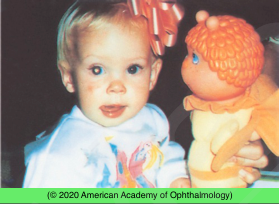
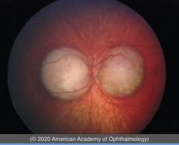

# Retinoblastoma

## Images

## Hierarchy

- Case Description
  - mother has noted white pupil in the right eye of her 1-year-old daughter
  - Image Description
    - external photograph shows leukocoria of the right eye
- Additional Testing
  - U/S
    - tumor thickness
    - calcification
  - IVFA
    - Coats disease
    - retinoblastoma
  - serology
    - ELISA for toxocariasis
  - MRI
    - optic nerve invasion
    - orbital (extraocular) extension
    - pinealoblastoma
      - .< 0.5% of unilateral cases
      - .< 5-15% of bilateral cases
        - every 4–8 weeks until age 3 years
  - CT scan
- Assessment
  - retinoblastoma
    - discouraged because of possible increased risk of secondary tumors due to radiation exposure
- Differential Diagnosis
  - retinoblastoma
  - cataract
  - persistent fetal vasculature (PFV)
  - retinopathy of prematurity (ROP)
  - FEVR
  - medulloepithelioma
  - toxocariasis
  - Norrie disease
  - incontinentia pigmenti
  - retinal astrocytoma
  - Coats disease
  - myelinated nerve fiber
  - retinal detachment
  - uveitis
- Treatment
  - small tumors
    - cryotherapy
    - photocoagulation
    - TTT
  - larger tumors
    - systemic chemotherapy
      - local therapy (consolidation)
      - often used in cases of bilateral retinoblastoma
    - intraarterial chemotherapy
      - alternative to systemic chemoreduction for unilateral retinoblastoma in group B, C, D, or E eyes
    - intravitreal chemotherapy
      - for refractory or recurrent vitreous seeding
    - plaque radiotherapy
    - enucleation
    - external beam radiation
      - seldom used
        - craniofacial deformity
        - secondary tumors in the field of radiation
  - Referrals
    - refer to ocular oncologist
    - consult with pediatric oncologist
    - genetic counselling
- Data acquisition
  - History
    - onset & progression of leukocoria
      - old photographs
    - one vs both eyes
    - premature birth
      - ROP
    - contact with puppies
      - toxocariasis
    - eating dirt
    - previous episode of red irritated eye
      - toxocariasis
    - family history
      - family history of rb
        - 5-10%
      - family history of cararact
  - Physical Exam
    - VA
    - IOP
    - extraocular motility/alignment
    - anterior segment exam
      - AC
        - pseudohypopyon
      - NVI
        - retinoblastoma
        - medulloepithelioma
      - cataract
      - corneal diameter
        - microcornea/microphthalmia
          - PFV
      - retrolental fibrous plaque
      - elongated ciliary processes
    - posterior segment exam with dilation
      - retinal tumor
      - retinal feeder/draining vessels
      - vitreous seeds
      - retinal vascular telangiectasia
      - retinal/subretinal exudation/ crystalline material
        - Coats disease
      - retinal fold
        - PFV
        - 30-40% of retinoblatoma is bilateral
    - examine both eyes
      - scleral depression to examine to ora
    - may need EUA
    - examine the eyes of parents’& siblings
      - retinoblastoma
        - in 1% of cases, a parent may have spontaneously regressed retinoblastoma/retinocytoma
      - FEVR
- Patient Education
  - General
    - malignant nature of tumor
    - hereditary nature
      - overall 40% have germline mutation
        - can transmit disease to children
      - only 10% of unilateral rb is germline
  - Prognosis
    - .>95% survival
  - Complications
    - systemic chermotherapy
      - low blood count
      - hair loss
      - hearing loss
      - neurologic and cardiac disturbances
      - renal toxicity
      - increased risk for AML
    - intraarterial chemotherapy
      - systemic
        - metastasis
        - neutropenia
      - ocular
        - periocular edema
        - cilia loss
        - vascular occlusion
        - blepharoptosis
        - temporary dysmotility
  - Follow-up
    - need for regular follow-up
      - development of new tumors in same or other eye
        - if germline
      - response to rx
        - every 4–8 weeks until age 3 years
      - tumor recurrence
        - can happen years after treatment
      - secondary malignancies
        - if germline
        - higher risk if radiation before 1 year of age
        - 1% per year of life
      - primitive neuroectodermal tumor (PNET) of the pineal gland
        - follow with periodic brain MRI
