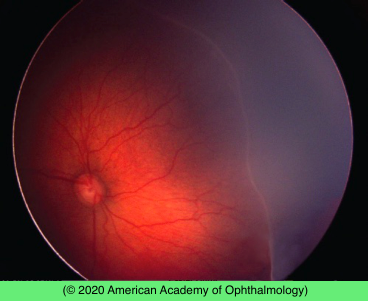

# Retinopathy of Prematurity

## Images

## Hierarchy

- Case Description
  - you are asked to examine a premature 4-week-old neonate
  - Image Description
    - fundus photograph of the left eye shows extensive peripheral nonperfusion temporally with demarcation ridge and normal retinal vessels posterior to the ridge
- Assessment
  - ROP
    - stage 2, zone 2 without plus disease
      - indication for treatment
- Treatment
  - Surgical
    - Cryo-ROP study
      - threshold disease
        - 5 contiguous clock hours or 8 total clock hours
        - stage 3
        - zone 1 or 2
        - plus disease
    - Early Treatment for ROP study
      - showed benefit of treating pre-threshold disease
      - type 1 (high risk)
        - zone 1 with plus disease (any stage)
        - zone 1, stage 3 (with or without plus disease)
          - treat
        - zone 2, stage 2 or 3 with plus disease
      - type 2 (lower risk)
        - follow closely
    - treatment modalities
      - cryotherapy
      - laser photocoagulation
        - preferred over cryo
- Differential Diagnosis
  - ROP
    - plus disease
      - 2 quadrants of engorged & tortuous retinal veins
    - staging
      - stage 1
        - demarcation line
      - stage 2
        - demarcation ridge
      - stage 3
        - fibrovascular proliferation
      - stage 4
        - subtotal RD
      - stage 5
        - total RD
    - zones
      - zone 1
        - centered on optic disc with radius of 2x optic disc-fovea distance
      - zone 2
        - outside zone 1 to nasal ora
      - zone 3
        - temporal retinal crescent
  - FEVR
    - AD
  - incontinentia pigmenti (IP)
    - XLD
      - girls only
        - M do not survive
    - infancy
      - blistering skin rash
    - early childhood
      - grey/brown skin patches
    - CNS and dental abnormalities
  - Norrie disease
    - XLR
      - boys only
- Patient Education
  - Prognosis & Complications
    - myopia
    - amblyopia
    - strabismus
    - glaucoma
    - cataract
    - macular dragging
    - retinal detachment
    - permanent vision loss
  - Follow-up
    - need for long-term follow-up
      - weekly exams until retina fully vascularized
      - @ 6 months
      - yearly
- Data acquisition
  - History
    - birth history
      - gestational age
        - <30 weeks
      - birth weight
        - <1500 gr
    - neonatal history
      - supplemental oxygen
      - neonatal sepsis
      - respiratory & GI disease
    - family history of FEVR
  - Physical Exam
    - screening recommendations
      - birth weight
        - <1500 gr
      - gestational age
        - <30 weeks
      - .>1500 gr or >30 weeks but with unstable clinical course
    - first eye exam
      - 31 weeks postmenstrual age
        - whichever is later
      - 4 weeks postnatal age
    - iris
      - prominent iris/pupillary vessels
        - ROP
          - Norrie disease
    - cataract & anterior segment abnormalities
    - dilated funduscopy with scleral depression
      - both eyes
