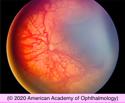
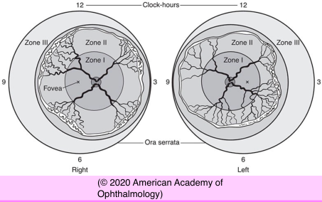
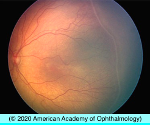
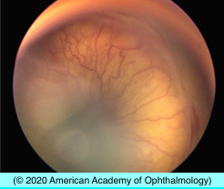
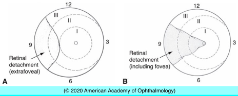
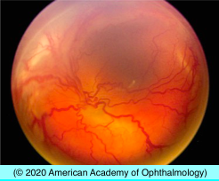

# Retinopathy of Prematurity (I)

## Images

## Hierarchy

- Epidemiology
  - United States
    - 1100–1500 infants annually
    - 400–600 will never achieve vision better than 20/200
  - recent rise in the incidence of ROP in resource-limited regions of the world
  - risk factors
    - prematurity
    - low birth weight
  - eyes with ROP in zone III typically have a good visual prognosis
- Terminology
  - plus disease
    - vascular dilation (venous) and tortuosity (arteriolar) of posterior retinal vessels in ≥2 quadrants
    - ± iris vascular dilatation & vitreous haze
  - Aggressive posterior ROP ( rush disease )
    - zone I or very posterior zone II + plus disease
    - can progress rapidly
  - Threshold disease
    - .> 5 contiguous clock-hours of extraretinal neovascularization
    - zone I or II
      - 8 cumulative clock-hours of extraretinal neovascularization (zone 1 or zone 2) in association with plus disease
  - Prethreshold disease
    - Early Treatment for Retinopathy of Prematurity (ETROP) study
    - all zone I and zone II ROP changes, except zone II stage 1 and zone II stage 2 without plus disease
      - should not meet threshold treatment criteria
        - type 1
          - high-risk prethreshold ROP
        - type 2
          - lower-risk prethreshold ROP
- international classification of ROP
  - zone
    - zone 1
      - within 60 ̊ circle around the optic disc
    - zone 2
      - from zone 1 to nasal ora serrata
    - zone 3
      - remaining temporal peripheral retina
  - stage
    - stage 0
      - immature retinal vasculature
    - stage 1
      - demarcation line
    - stage 2
      - ridge
      - ± popcorns
        - small isolated tufts of neovascular tissue
    - stage 3
      - ridge of extraretinal fibrovascular proliferation
    - stage 4
      - partial RD
        - 4A
          - extrafoveal
        - 4B
          - involving fovea
    - stage 5
      - total RD
  - extent
    - ≠ clock hours
- Pathophysiology
  - normal retinal vascularization
    - begins at ≈ week 16 of gestation
      - proceeds from optic disc to periphery
    - completed
      - nasally
        - ≈ week 36 of gestation
      - temporally
        - ≈ week 40 of gestation
  - 2-phase process
    - first phase
      - breathing by infant after birth
        - increase in systemic oxygen tension
          - decrease in level of growth factors
            - VEGF & insulin-like growth factor 1 (IGF-1)
            - cessation of normal vascular development
    - second phase
      - 31–34 weeks’ postconceptional age
        - ischemic retina
          - increase in level of growth factors
            - disorganized vascular growth
              - cicatricial contraction & tractional retinal detachment
  - signs of active disease
    - dilation and increased tortuosity of the retinal vessels posteriorly
    - increased and abnormal terminal arborization of retinal vessels as they approach the shunt or ridge
    - microvascular abnormalities (eg, microaneurysms, areas of capillary nonperfusion, and dilated vessels) posterior to the ridge
  - vasoproliferative phase
    - new vessels arise from retinal vessels just posterior to the shunt
      - vitreous hemorrhage
        - exudative retinal detachment
  - earlier disease stages may regress spontaneously
    - peripheral
    - smaller its size and extent
- tissue ridge
  - (ROP stages 1, 2)
  - cicatricial contraction
    - tissue ridge + vascular proliferation into vitreous cavity
      - (ROP stage 3)
    - progressive tractional retinal detachment
      - (ROP stages 4, 5)
    - dense, white, fibrovascular plaque behind the lens
      - retrolental fibroplasia
