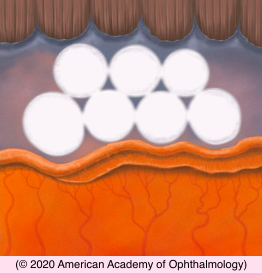
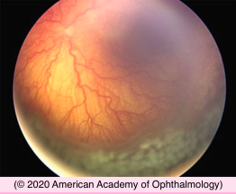

# Retinopathy of Prematurity (III): Treatment

## Images

## Hierarchy

- Prevention and Risk Factors
  - risk factors
    - prematurity
    - extremely low birth weight
    - supplemental oxygen administration
    - postnatal sickness
      - sepsis
      - blood transfusion
      - slow rate of postnatal weight gain
  - prevention
    - avoiding extremely low birth weight and short gestational ages
    - optimal pre-, peri-, and postnatal care
    - diet
      - addition of inositol
- Cryotherapy for ROP study
  - cryotherapy of avascular anterior retina in ROP eyes with threshold disease reduced the incidence of unfavorable outcome by ≈ 50%
    - from 47% to 25% at 1 year follow-up
    - visual results paralleled anatomical results
    - at 10 years, eyes that received cryotherapy were much less likely to be blind
- Laser and Cryoablation Surgery
  - laser preferred over cryoablation surgery
    - laser surgery has less treatment-related morbidity
  - indications for retinal cryoablation
    - laser is not available
    - media opacities or persistent tunica vasculosa lentis
  - technique
    - start treatment within 72 hours
    - indirect ophthalmoscopy
    - avascular retina anterior to the ridge
    - confluent or subconfluent scatter fashion
    - apply lighter pattern to horizontal meridia
      - can damage the long ciliary vessels and nerves
      - can lead to severe anterior segment ischemia
  - respiratory or cardiorespiratory arrest can occur
    - ≤ 5%
    - pediatric consultation with systemic monitoring
    - systemic analgesia
    - ± general anesthesia in an operating room
- ETROP trial
  - classified eyes with prethreshold ROP as high-risk or low-risk
    - based on computational model using demographic and clinical features
  - patients with bilateral, high-risk, prethreshold ROP
    - random assignment
      - 1 eye
        - early ablation of avascular retina
      - fellow eye
        - conventional management according to Cryotherapy for ROP study
    - earlier treatment
      - reduction in unfavorable grating visual acuity outcomes
        - from 19.5% to 14.5%
      - reduction in unfavorable structural outcomes
        - from 15.6% to 9.1%
          - at 9 months
  - conclusion
    - clinical categorization of prethreshold eyes into type 1 vs. type 2 ROP achieved similar results to the computational model (high-risk vs. low-risk)
      - type 1 ROP eyes should be considered for peripheral retinal ablative treatment
    - type 2 ROP eyes can be monitored in short intervals and laser ablative treatment considered if they progress to type 1 ROP or threshold ROP
    - prethreshold treatment algorithm did not take into account all other known risk factors for progression and clinical judgment is still required
- Vitrectomy and Scleral Buckling Surgery
  - stage 4 ROP (progressive, active-phase ROP)
    - scleral buckling
    - lens-sparing vitrectomy
    - stage 4A has more favorable outcome than stages 4B or 5
  - stage 5 disease
    - vitrectomy with dissection of fibrovascular membranes and adherent vitreous
      - full or partial reattachment in ≈ 30% of eyes
        - only 25% of these eyes remained fully attached 5 years later
        - only 10% of these eyes eventually had ambulatory vision
  - drainage retinotomy or iatrogenic retinal break associated with uniformly poor prognosis
- Anti-VEGF Drugs
  - BEAT-ROP (Bevacizumab Eliminates the Angiogenic Threat of Retinopathy of Prematurity) Cooperative Group
    - zone I or zone II posterior stage 3 ROP with plus disease
    - intravitreal bevacizumab monotherapy
      - compared with conventional laser therapy, bevacizumab was significantly more benefitial for zone I ROP, whereas zone II disease had similar outcomes
        - laser therapy led to permanent destruction of the peripheral retina
          - prolonged, close follow-up is essential
    - normal peripheral retinal vascularization continued after treatment with intravitreal bevacizumab
    - recurrences occurred significantly later with bevacizumab than with laser therapy
  - use of bevacizumab in eyes previously treated with laser is not recommended
