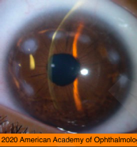
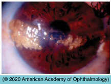

# Salzmann Nodular Degeneration

## Images

## Hierarchy

- Case Description
  - 60-year-old asymptomatic woman
  - Image Description
    - round gray-white elevated paracentral corneal nodules
- Data acquistion
  - History
    - eye symptoms
      - recurrent foreign body sensation
      - blurred vision
      - Salzman nodular degeneration is usually asymptomatic
    - chronic inflammatory ocular conditions
  - Physical Exam
    - chronic inflammatory ocular conditions
      - phlyctenulosis
      - trachoma
        - upper tarsal follicular reaction
        - Arlt's line
        - Herbert pits
      - interstitial keratitis
      - VKC
        - upper tarsal papillary hypertrophy
        - Horrner-Trantas dots
        - shield ulcer
      - chronic dry eye
      - chronic blepharitis
- Assessment
  - Salzman nodular degeneration
- Differential Diagnosis
  - Salzman nodular degeneration
    - Salzman nodular degeneration
      - +- bilateral
        - middle aged - older women
      - usually asymptomatic unless ...
        - central location
        - irregular astigmatism
        - corneal epithelial erosion
          - may not appear until years after the active keratitis
      - etiology
        - idiopathic
        - late sequela to old long-term keratitis
          - phlyctenulosis
          - trachoma
          - interstitial keratitis
      - gray-white or blue-white nodules
        - elevated
        - roughly circular configuration
        - central or paracentral cornea
        - at the ends of vessels of a pannus
        - recurrent erosion
      - treatment
        - lubrication
        - manual superficial keratectomy
          - decreased vision secondary to irregular astigmatism
  - spheroidal degeneration
    - Spheroidal degeneration
      - translucent, golden brown, spheroidlike deposits
        - cornea +- conjunctiva
        - subepithelium, Bowman layer, or superficial stroma
      - types
        - primary spheroidal degeneration
          - unrelated to the coexistence of other ocular disease
          - bilateral
          - nasal and temporal cornea
            - with age, can extend onto the conjunctiva in the interpalpebral zone
            - rarely extends across the interpalpebral zone of the cornea
              - noncalcific band-shaped keratopathy
        - secondary spheroidal degeneration
          - ocular injury or inflammation
          - near corneal scarring or vascularization
      - management
        - no medical therapy is of much value
        - lubrication
        - central involvement
          - superficial keratectomy
          - phototherapeutic keratectomy
            - excimer laser
        - recurrence after conjunctival resection is common
- Treatment
  - Medical
    - eye lubrication
    - RGP contact lens
      - for irregular astigmatism
  - Surgical
    - superficial keratectomy
    - PTK
    - lamellar keratoplasty
- Patient Education
  - General
  - Prognosis
    - good prognosis
  - Course
    - can recur after excision
  - Complications
    - recurrent corneal erosion
    - irregular astigmatism
    - decreased vision if central cornea involved
  - Follow-up
    - routine if no complications
