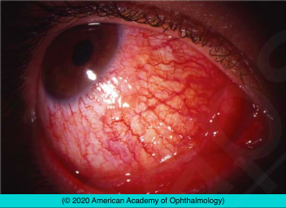

# Scleritis

## Images

## Hierarchy

- Case Description
  - 40-year-old woman complains of diffuse redness and severe boring pain of her right eye that radiates to her right forehead
  - Image Description
    - diffuse redness of right eye with congested scleral vessels that have a crisscross pattern
- Additional Testing
  - systemic workup
    - CBC, diff, ESR, CRP
    - RA
      - RF
    - Wegener's
      - ANCA
      - U/A
      - creatinine
    - PAN
      - ANCA
    - SLE
      - ANA
    - ankylosing spondylitis
      - sacroiliac x-ray
      - HLA-B27
    - gout
      - uric acid
    - infections
      - herpes zoster
      - syphilis
        - RPR or VDRL/ FTA-ABS or MHA-TP
      - lyme
        - lyme antibody
      - TB
        - PPD, CXR
      - atypical mycobacteria
      - fungi
      - nocardia
      - pseudomonas
        - culture/staining for infectious agents
  - B-scan
    - ciliary body tumor
    - posterior scleritis
  - IVFA
    - posterior scleritis
- Differential Diagnosis
  - scleritis
    - associated diseases
      - 1/2
        - gout
      - infectious
        - syphilis
        - tuberculosis
        - herpes zoster
        - lyme disease
        - “cat-scratch” disease
        - leprosy
      - autoimmune connective tissue diseases
        - rheumatoid arthritis
        - systemic lupus erythematosus
        - seronegative spondyloarthropathies (eg, ankylosing spondylitis)
        - giant cell arteritis
          - polyarteritis nodosa
            - wegener granulomatosis
          - relapsing polychondritis
  - episcleritis
    - younger
    - milder
    - more acute
  - conjunctivitis
    - vessels blanch with topical phenylephrine (2.5%)
  - orbital cellulitis/orbital pseudotumor
  - ciliary body tumors
  - VKH
    - resembles posterior scleritis
- Assessment
  - scleritis, diffuse
  - only one NSAID should be prescribed at a time
- Treatment
  - Medical
    - artificial tears
    - difluprednate eyedrop
    - oral NSAIDS
      - gastroprotective medication
    - oral steroid
      - indications
        - not responsive to NSAID
          - decreased pain is first sign of response to treatment
        - severe disease
          - severe nodular scleritis
          - necrotizing scleritis
          - sclerokeratitis
      - start at 1 mg/kg daily and then taper within the first 2 weeks of treatment
        - taper slowly
      - calcium (600 mg) with vitamin D (400 iU)
      - gastroprotective medication
      - NSAIDs and steroids should not be used simultaneously
    - immunosuppressive therapy
      - if
        - unresponsive to oral steroid
        - requires >7.5-10 mg prednisone/day for long-term control
      - MTX, cyclophosphamide, etc
    - subconjunctival steroid
      - for patients who cannot tolerate systemic treatment
  - Surgical
    - not for necrotizing scleritis
    - scleral patch graft
      - for scleral thinning
      - after inflammation subsides
  - Referrals
    - refer to internist or rheumatologist for systemic work-up
      - up to 50% have systemic disease
- Data acquisition
  - History
    - medical history
      - foreign travel
        - systemic immune-mediated diseases
        - TB
      - STD
        - syphilis
    - ocular history
      - onset/course of symptoms
        - eye pain
          - boring
          - awakens patient from sleep
          - increases with eye movement
          - increases with touch
          - radiates to forehead & jaw
        - decreased vision
      - prior episodes
      - ocular trauma/surgery
  - Physical Exam
    - VA
    - IOP
    - scleral vascular congestion
      - bluish hue in natural light
        - examine under natural light or adequate room light
      - slit lamp exam with red-free filter
      - does not move with cotton swab
      - does not blanch with 2.5% phenylephrine
    - nodules
    - scleral thinning
    - AC rxn
      - peripheral keratitis
    - cataract
    - ciliary body tumor
    - posterior scleritis
      - subretinal granulomas
      - choroidal folds
      - exudative RD
      - optic disc swelling
      - hyperopia
- Patient Education
  - General
    - association with systemic disease
  - Course
    - recurrent episodes common
  - Prognosis
    - generally responds to treatment
    - necrotizing scleritis associated with high mortality
      - coronary arteritis
      - cerebral angiitis
  - Complications
    - scleral thinning
  - Dos
    - protective eyeglasses for scleral thinning
