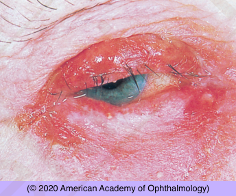

# Sebaceous Carcinoma

## Images

## Hierarchy

- Case Description
  - elderly woman complains of unilateral lid redness and irritation of 2 years duration
  - Image Description
- Data acquisition
  - History
    - onset & course
    - prior conjunctivitis
    - chronic use of topical medications
    - previous treatments
    - prior radiation exposure
  - Physical Exam
    - complete eye exam
      - loss of eyelashes
      - destruction of meibomian gland orifices
      - orbital signs
    - regional lymphadenopathy
- Additional Testing
  - lid biopsy
    - send specimen fresh
    - coordinate with ocular pathologist
  - orbital imaging
    - if orbital signs
  - consider sentinel lymph node biopsy
- Assessment
  - sebaceous carcinoma
- Differential Diagnosis
  - sebaceous carcinoma
    - middle-aged or elderly
      - diffuse eyelid erythema and eyelid thickening with loss of eyelashes
    - F>M
    - prior radiation exposure
    - unilateral
    - upper eyelid
      - masquerades as recurrent chalazia or chronic blepharoconjunctivitis
    - lash loss
    - regional lymph node or distant metastasis
    - ± orbital extension
    - Muir-Torre syndrome
      - autosomal dominant
      - multiple acquired
        - sebaceous adenomas
        - sebaceous hyperplasia
        - basal cell carcinomas with sebaceous differentiation
      - increased incidence of visceral malignancy
        - especially colorectal
        - genitourinary
      - ± lid sebaceous carcinoma
        - rare
  - BCC
  - SCC
  - unilateral blepharoconjunctivitis
    - infectious
    - toxic
- Treatment
  - Surgical
    - stage 1
      - map biopsy
    - stage 2
      - excision + cryotherapy
        - subsequent lid reconstruction
          - if negative margins
      - exenteration
        - for orbital invasion
          - especially if no metastatic disease
        - for extensive disease
  - Referrals
    - refer to oncologist for metastatic work-up
      - lymph nodes, brain, lung, liver, bone
- Patient Education
  - Prognosis & Complications
    - discuss risk of
      - local recurrence
      - orbital extension
      - lymph node metastasis
      - distant metastasis
  - Follow-up
    - q 1 week after surgery
      - q 3-4 months
        - monitor closely for recurrence
