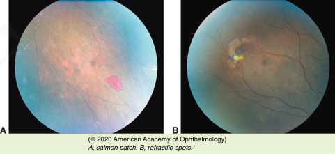
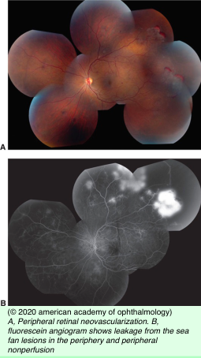
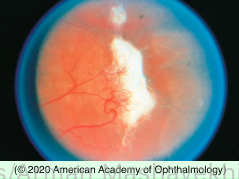

# Sickle Cell Retinopathy

## Images

## Hierarchy

- Introduction
  - hemoglobin
    - two alpha-globin subunits
    - two beta-globin subunits
  - HBB gene mutation
    - 11p15.4
    - abnormal versions of beta- globin
      - causes sickle cell hemoglobinopathy
    - unusually low levels of beta- globin
      - causes beta thalassemia
  - mutant hemoglobins S, C, or both are of greatest ocular importance
  - most prevalent in the black population
    - sickle cell trait (Hb AS)
      - 8%
    - sickle cell disease (Hb SS)
      - 0.4%
    - hemoglobin SC disease
      - 0.2%
- other clinical findings
  - conjunctiva
    - segmentation of blood in the conjunctival blood vessels
    - comma sign
      - comma-shaped thrombi dilate and occlude capillaries
      - inferior bulbar conjunctiva and fornix
  - disc sign of sickling
    - small vessels on the surface of the optic disc can exhibit intravascular occlusions
      - dark red spots
  - angioid streaks
    - 6% of cases of SS disease
    - AS trait
- Nonproliferative Sickle Cell Retinopathy
  - pathogenesis
    - arteriolar and capillary occlusion
    - anastomosis and remodeling occur in the periphery
  - salmon-patch hemorrhage
    - area of intraretinal hemorrhage after a peripheral retinal arteriolar occlusion
  - refractile spots
    - old, resorbed hemorrhages with hemosiderin deposition within the inner retina just beneath ILM
  - black “sunburst” lesions
    - localized areas of retinal pigment epithelial hypertrophy, hyperplasia, and pigment migration in the peripheral retina
    - caused by hemorrhage
  - occlusion of parafoveal capillaries and arterioles
  - spontaneous occlusion of the central retinal artery
- 5 stages
  - peripheral arteriolar occlusions
  - peripheral arteriovenular anastomoses
    - dilated, preexisting capillary channels
  - preretinal sea fan neovascularization
    - at the posterior border of areas of nonperfusion
  - vitreous hemorrhage
  - tractional retinal detachment
- Lab
  - sickling and solubility tests (sickle cell preparations)
    - for screening
    - do not distinguish between heterozygous and homozygous states
  - Hemoglobin electrophoresis
    - should be performed for patients testing positive on sickle cell preparations
- Management
  - hyphema
    - all black patients with traumatic hyphema should be screened for sickling hemoglobinopathy (including trait)
    - increased risk of complications
      - control of IOP may be difficult
      - ischemic optic neuropathy may result from short intervals of a modest increase in IOP
    - consider early anterior chamber washout in presence of hyphema with increased IOP
    - be cautious in the use of carbonic anhydrase inhibitors
      - may worsen sickling through the production of systemic acidosis
  - Photocoagulation
    - peripheral scatter photocoagulation
      - lower-intensity light burns to the ischemic peripheral retina
        - more commonly after such treatment in PSR than in proliferative diabetic retinopathy
    - caution
      - retinal tears and subsequent rhegmatogenous retinal detachment can occur
  - Vitreoretinal surgery in PSR
    - indications
      - nonclearing vitreous hemorrhage
      - rhegmatogenous, tractional, schisis, or combined retinal detachment
    - retinal detachment
      - usually begins in the ischemic peripheral retina
      - tears typically occur at the base of sea fans
      - often precipitated by photocoagulation
    - precautions
      - adequate patient hydration
      - supplemental nasal oxygenation
      - judicious use of expansile gases to minimize IOP elevations
      - 360° scleral buckling can cause anterior segment ischemia or necrosis
        - exchange transfusion before vitreoretinal surgery is no longer favored
        - particularly when combined with extensive diathermy or cryopexy
- proliferative sickle cell retinopathy (PSR)
  - Introcuction
    - retinal ischemia
      - secondary to infarction of the retinal tissue by means of arteriolar, precapillary arteriolar, capillary, or venular occlusions
    - SS disease
      - sickle cell hemoglobin C (SC) and sickle cell thalassemia (SThal)
        - more serious ocular complications
      - more systemic complications
  - clinical findings
    - retinal neovascularization
      - located more peripherally
        - neovascularization in PDR generally begins postequatorially
    - white sea fan neovascularization
      - results from autoinfarction of the peripheral neovascularization
        - auto infarction not common in PDR
    - preretinal or vitreous hemorrhage
    - tractional retinal detachment
      - secondary to extraretinal fibrovascular proliferation
