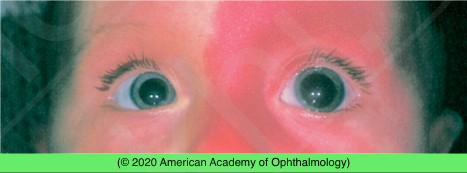

# Sturge-Weber Syndrome

## Images

## Hierarchy

- Case Description
  - infant with reddish skin discoloration on one side of face present since birth
  - Image Description
- external photograph shows flat red pigmentation of the left side of facial skin consistent with facial port- wine stain; the left cornea is larger than the right cornea
- Data acquisition
  - History
    - age of onset/course
      - old photographs
    - signs of glaucoma
      - tearing
      - photophobia
      - blepharospasm
      - differences in eye size
      - intermittent corneal clouding
    - mental retardation, seizure
  - Physical Exam
    - VA
    - IOP
    - ocular motility & alignment
      - eye preference
        - r/o amblyopia
    - slit lamp
      - conjunctival/episcleral vascular tortuosity
      - corneal edema
        - corneal diameter
      - Haab striae
      - iris heterochromia
    - funduscopy
      - diffuse choroidal hemangioma
      - serous RD
      - optic nerve cupping
        - myopia caused by long- standing glaucoma
    - cycloplegic refraction
    - limb hypertrophy, varicosities
      - Klippel-Trénaunay-Weber syndrome
    - ocular melanocytosis
      - phakomatosis pigmentovascularis
      - r/o leptomeningeal angiomatosis
- Additional Testing
  - brain MRI or CT
- Assessment
  - Sturge-Weber syndrome with port-wine stain
- Differential Diagnosis
  - port-wine stain (nevus flammeus)
    - associated with
      - Sturge-Weber syndrome ( cerebrofacial angiomatosis )
        - non-hereditary
        - nevus flammeus (portwine stain)
          - present from birth
          - usually unilateral
          - follows the distribution of CN V
        - glaucoma
          - particularly associated with upper lid hemangioma
        - parieto-occipital leptomeningeal hemangioma
          - seizure
            - mental retardation
        - heterochromia iridis
        - diffuse choroidal hemangioma
          - “tomato ketchup” appearance
          - exudative retinal detachment
      - Klippel-Trénaunay-Weber syndrome
        - variant of cerebrofacial angiomatosis
          - non-hereditary
        - nonocular findings
          - nevus flammeus (portwine stain) of limb
          - hemihypertrophy of limb
            - bone & soft tissues
          - varicosities
          - intracranial hemangioma
        - ocular findings
          - nevus flammeus (portwine stain)
          - conjunctival telangiectasia
          - congenital glaucoma
      - phakomatosis pigmentovascularis
        - in combination with ocular melanocytosis
  - periocular contact dermatitis
  - preseptal cellulitis
  - erysipelas
- Treatment
  - Medical
    - glaucoma
      - medical
        - topical glaucoma medication
          - avoid brimonidine in infants
            - can cause CNS depression, apnea
        - oral acetazolamide
      - Surgical
        - goniotomy
          - if medical rx not adequate
        - trabeculotomy
    - anisometropia correction
    - patching for amblyopia
    - PDT or radiation for symptomatic choroidal hemangioma
    - lasers can be used to decrease skin pigmentation
  - Referrals
    - refer to neurologist for leptomeningeal angiomatosis
- Patient Education/ Counselling
  - Complications
    - discuss SW syndrome and its associations
      - glaucoma
        - 30%–70%
        - treatment of glaucoma associated with SW syndrome is difficult
          - often requires surgery
      - choroidal hemangioma
        - ≤50%
        - serous RD
      - leptomeningeal angiomatosis
  - Follow-up
    - monitor for glaucoma
      - may occur at any time
      - q6 mo
