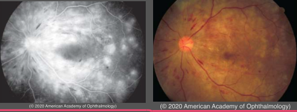
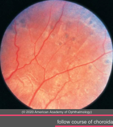
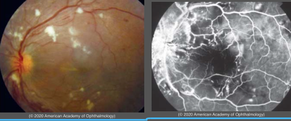
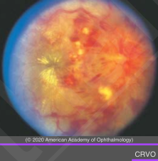

# Systemic Arterial Hypertension

## Images

## Hierarchy

- Definition
  - affects >72 million Americans
  - normal
    - <120/80 mm Hg
  - elevated blood pressure
    - 120–129 mm Hg systolic and <80 mm Hg diastolic
  - stage 1 hypertension
    - 130–139 mm Hg systolic or 80–89 mm Hg diastolic
  - stage 2 hypertension
    - systolic BP ≥140 mm Hg or diastolic BP ≥90
- Hypertensive choroidopathy
  - episode of acute hypertension in young patients
    - preeclampsia/eclampsia
    - pheochromocytoma
    - renal hypertension
  - lobular choriocapillaris nonperfusion
    - Elschnig spot
      - acute
        - tan
        - lobule-sized patch
      - chronic
        - hyperpigmented
        - hypopigmented margin
    - Siegrist streaks
      - follow course of choroidal arteries
    - ± focal RPE detachments
    - ± extensive (bilateral) exudative RD
      - rare
  - fluorescein angiography
    - early
      - focal choroidal hypoperfusion
    - late
      - multiple subretinal areas of leakage
- Hypertensive retinopathy
  - affects
    - precapillary arterioles
    - capillaries
  - acute hypertensive episode
    - focal intraretinal periarteriolar transudates (FIPT)
      - deeper
        - CWSs affect NFL
      - smaller
        - than cotton-wool spots
      - less white
      - punctuate hyperfluorescence on FA
    - cotton-wool spots
      - ischemia in NFL
      - non-perfusion on FA
  - chronic hypertensive retinal lesions
    - microaneurysms
    - intraretinal microvascular abnormalities (IRMA)
    - blot hemorrhages
    - lipid exudates
    - venous beading
    - neovascularization
    - signs of ischemic retinopathy
  - arteriolosclerotic retinopathy (modified Scheie classification)
    - predisposing factors
      - duration and severity of hypertension
      - presence of diabetic retinopathy
        - coexistent hypertension & DM causes more severe retinopatthy
      - severity of any dyslipidemia
      - patient age
      - history of smoking
    - modified Scheie classification
      - grade 0
        - no changes
      - grade 1
        - barely detectable arterial narrowing
      - grade 2
        - obvious arterial narrowing with focal irregularities
      - grade 3
        - grade 2 + retinal hemorrhages and/or exudates
      - grade 4
        - grade 3 + optic disc swelling
  - complications
    - BRAO
    - BRVO
    - CRVO
    - retinal arterial macroaneurysms
- Hypertensive optic neuropathy
  - severe hypertension
    - linear peripapillary flame-shaped hemorrhages
    - blurring of disc margins
    - florid disc edema
    - secondary retinal venous stasis
    - macular exudates
  - differential diagnosis
    - CRVO
    - anterior ischemic optic neuropathy
    - diabetic papillopathy
    - radiation papillopathy
    - neuroretinitis
